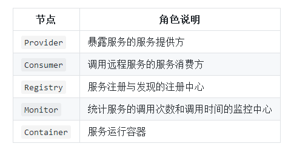

# dubbo-consumer

[Dubbo官方文档](http://dubbo.apache.org/zh-cn/docs/user/quick-start.html "Dubbo官方文档")

#### dubbo架构图如下：

#### 节点角色说明

#### 调用关系说明:
- 服务容器负责启动，加载，运行服务提供者。

- 服务提供者在启动时，向注册中心注册自己提供的服务。

- 服务消费者在启动时，向注册中心订阅自己所需的服务。

- 注册中心返回服务提供者地址列表给消费者，如果有变更，注册中心将基于长连接推送变更数据给消费者。

- 服务消费者，从提供者地址列表中，基于软负载均衡算法，选一台提供者进行调用，如果调用失败，再选另一台调用。

- 服务消费者和提供者，在内存中累计调用次数和调用时间，定时每分钟发送一次统计数据到监控中心。

具体详细内容请参加dubbo官方文档
> http://dubbo.apache.org/zh-cn/index.html

 

# 实际运用

导入dubbo-starter依赖，在 application.properties 或者 application.yml 配置属性，使用@Service【暴露服务】、使用@Reference【引用服务】

## pom.xml添加Dubbo依赖
    <dependency>
    	<groupId>org.apache.dubbo</groupId>
    	<artifactId>dubbo-spring-boot-starter</artifactId>
    	<version>2.7.6</version>
    </dependency>

## 生产者配置
    dubbo:
      registry:
        #注册中心地址
    #    address: N/A
        address: zookeeper://127.0.0.1:2181
    #    address: 127.0.0.1 # zookeeper注册中心的地址
    #    port: 2181       # zookeeper注册中心的端口
    #    protocol: zookeeper       #使用zookeeper协议
        #指定注册到zk上超时时间，ms
        timeout: 10000
      #指定dubbo使用的协议、端口
      protocol:
        name: dubbo
        port: 20880
      #指定实现服务(提供服务）的包
      scan:
        base-packages: com.zhuaer.learning.dubbo.provider.service

Springboot 启动类使用 **@EnableDubbo**  //会扫描所有的包，从中找出dubbo的@Service标注的类，
**@DubboComponentScan**(basePackages = "com.zhuaer.learning.dubbo.provider.service")  //只扫描指定的包，也可以通过配置文件进行配置

    dubbo.scan.base-packages=com.zhuaer.learning.dubbo.provider.service

### 提供服务
使用 **@Service** 注解对外提供服务，注意是**org.apache.dubbo.config.annotation.Service**的Service类

    @Service(version = "1.0.0")
    public class UserServiceImpl implements UserService {
        @Override
        public String queryUser() {
            return "root";
        }
    }

Service还包含其他属性： **interfaceName**、**group**、**path**等

## 消费者配置

消费者启动开启检查，如果注册中心没有依赖的服务，会中断Spring启动程序

    dubbo:
      registry:
        #注册中心地址
        address: zookeeper://127.0.0.1:2181
        #    address: 127.0.0.1 # zookeeper注册中心的地址
        #    port: 2181       # zookeeper注册中心的端口
        #    protocol: zookeeper       #使用zookeeper协议
        #指定注册到zk上超时时间，ms
        timeout: 10000
      #指定dubbo使用的协议、端口
      protocol:
        name: dubbo
        port: 20880
      consumer:
        #启动应用时是否检查注册中心上有没有依赖的服务，默认true
    #    check: false
        # 服务调用重试次数
        retries: 2
        timeout: 1000

### 消费服务

消费接口使用 **@Reference** 注解

    //    @Reference(version = "1.0.0")
    //直连方式，不经过注册中心
    @Reference(url = "dubbo://127.0.0.1:20880", version = "1.0.0")
    private UserService userService;
    
    @GetMapping("user")
    public String user() {
    	return userService.queryUser();
    }