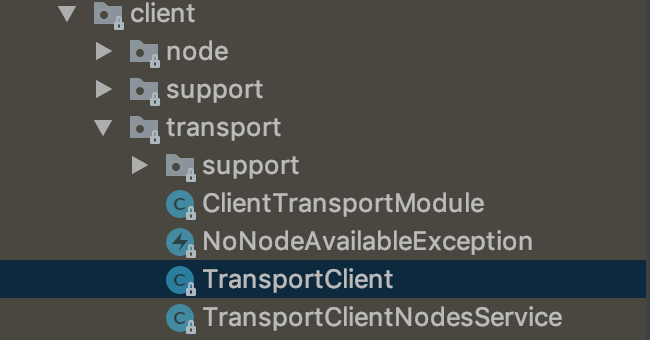

# elasticsearch-rest

## 一、SpringBoot模版方式接入(不建议)
其实一开始是准备用SpringBoot的模版来直接接入使用的，也就是以下这样的接入方式，也是网上大家都这么说的使用方式。

    <dependency>
    	<groupId>org.springframework.boot</groupId>
    	<artifactId>spring-boot-starter-data-elasticsearch</artifactId>
    </dependency>

但是后面看java api的[官方文档](https://www.elastic.co/guide/en/elasticsearch/client/java-api/current/java-api.html "官方文档")

> Deprecated in 7.0.0.
The TransportClient is deprecated in favour of the [Java High Level REST Client](https://www.elastic.co/guide/en/elasticsearch/client/java-rest/7.9/java-rest-high.html "Java High Level REST Client") and will be removed in Elasticsearch 8.0. The [migration guide](https://www.elastic.co/guide/en/elasticsearch/client/java-rest/7.9/java-rest-high-level-migration.html "migration guide") describes all the steps needed to migrate.

再看看模版方式引入的源码

直接模版方式的java api调用方式，后续官方会不支持了，不建议使用，要使用[Java High Level REST Client](https://www.elastic.co/guide/en/elasticsearch/client/java-rest/7.1/java-rest-high.html "Java High Level REST Client")来代替，`Elasticsearch 8.0`版本后直接移除，想想还是换人家建议的使用方式吧，免得以后更新换代还得做迁移，也就是我们现在准备的使用方式。

## 二、High Level Java REST Client方式接入

使用High Level Java REST Client进行Elasticsearch检索查询，第一步添加依赖
    
    <dependency>
    	<groupId>org.elasticsearch</groupId>
    	<artifactId>elasticsearch</artifactId>
    	<version>7.9.1</version>
    </dependency>
    
    <!-- Java High Level REST Client -->
    <dependency>
    	<groupId>org.elasticsearch.client</groupId>
    	<artifactId>elasticsearch-rest-high-level-client</artifactId>
    	<version>7.9.1</version>
    </dependency>

添加依赖之后即可进行初始化`RestHighLevelClient`

    RestHighLevelClient client = new RestHighLevelClient(
            RestClient.builder(
                    new HttpHost("localhost", 9200, "http")));
                    
这个 client的内部会维护一个线程池，所以在任务完成后可以通过 client.close()来释放资源，但是这得看需求，如果需要频繁进行查询的话，就直接做成单例，避免线程池的不断创建和释放也会影响应用的性能

结合springboot 配置文件使用

**application.yml:**
    
    es:
      host: localhost
      port: 9200
      scheme: http

**ElasticConfig:**
    
    import org.apache.http.HttpHost;
    import org.elasticsearch.client.RestClient;
    import org.elasticsearch.client.RestClientBuilder;
    import org.elasticsearch.client.RestHighLevelClient;
    import org.springframework.beans.factory.annotation.Autowired;
    import org.springframework.beans.factory.annotation.Value;
    import org.springframework.context.annotation.Bean;
    import org.springframework.context.annotation.Configuration;
    
    /**
     * @ClassName ElasticConfig
     * @Description TODO
     * @Author zhua
     * @Date 2020/9/10 17:35
     * @Version 1.0
     */
    @Configuration
    public class ElasticConfig {
    
        @Value("${es.host}")
        public String host;
        @Value("${es.port}")
        public int port;
        @Value("${es.scheme}")
        public String scheme;
    
        @Bean
        public RestClientBuilder restClientBuilder() {
            return RestClient.builder(makeHttpHost());
        }
    
        @Bean
        public RestClient elasticsearchRestClient(){
            return RestClient.builder(new HttpHost(host, port, scheme)).build();
        }
    
        private HttpHost makeHttpHost() {
            return new HttpHost(host, port, scheme);
        }
    
        @Bean
        public RestHighLevelClient restHighLevelClient(@Autowired RestClientBuilder restClientBuilder){
            return new RestHighLevelClient(restClientBuilder);
        }
    
    }
                    
## Elasticsearch数据结构

在我们这边的使用场景中，Elasticsearch是用来存储各个端的日志，在这种场景下，每一条日志就是一个Document(文档)，我们知道日志中包含了很多信息，比如上传时间，浏览器，ip等等，每条日志中包含多个字段信息就是Field(字段)，不同的日志可能有不同的类型，比如服务器日志，用户行为日志，这就是Type(类型)，每天的日志分开进行存储是Indice(索引)，可以类比于关系型数据库比如MySQL。

|  关系型数据库 | Elasticsearch  |
| ------------ | ------------ |
| Databases(数据库)  | Indices(索引)  |
| Tables(表)  |  Types(类型) |
| Rows(行)  | Documents(文档)  |
| Columns(列)  | Fields(字段) |

Elasticsearch包含多个索引(indices)（数据库），每个索引可以包含多个类型(types)（表），每个类型包含多个文档(documents)（行），每个文档包含多个字段(Fields)（列）。

### Elasticsearch条件查询
第一步需要初始化`SearchRequest`，设置索引(indices)和类型(types)，以上面添加的日志为例。

    SearchRequest searchRequest = new SearchRequest();
    searchRequest.indices("customer");
    searchRequest.types("_doc");
    
然后需要组合查询条件，主要涉及到`=`、`!=`、`>`、`<`这几个条件的查询，需要更复杂的可以查看官方文档。
    
    // 条件=
    MatchQueryBuilder matchQuery = QueryBuilders.matchQuery("city", "北京");
    TermQueryBuilder termQuery = QueryBuilders.termQuery("province", "福建");
    
    // 范围查询
    RangeQueryBuilder timeFilter = QueryBuilders.rangeQuery("log_time").gt(12345).lt(343750);

构建好需要的查询条件后，需要进行组合查询，在组合查询里头实现!=条件查询，需要用到`BoolQueryBuilde`r，`BoolQueryBuilder`包含4个方法:
- `must` 相当于 `&(与)`条件。
- `must not` 相当于`~(非)`条件。
- `should` 相当于 `| (或)`条件。
- `filter` 类似`must`，区别在于它不参与计算分值，在不需要用到分值计算的时候效率更高。

    QueryBuilder totalFilter = QueryBuilders.boolQuery()
    	.filter(matchQuery)
    	.filter(timeFilter)
    	.mustNot(termQuery);

### Elasticsearch分页查询
可以设置每次查询返回的文档数量，如果不设置的话，默认只返回10条hits，这个数量可以手动设置:

    sourceBuilder.query(totalFilter).size(100);
    
单单设置返回条数还不满足需求，因为我们这边是没有办法事先确定的，所以需要自己来实现分页，需要from()方法进行辅助。

完整示例代码如下:

    @Service
    public class TestService {
    	@Autowired
    	RestHighLevelClient highLevelClient;
    
    	private void search(RestHighLevelClient highLevelClient) throws IOException {
    
    		SearchRequest searchRequest = new SearchRequest();
    		searchRequest.indices("customer");
    		searchRequest.types("_doc");
    
    		// 条件=
    		MatchQueryBuilder matchQuery = QueryBuilders.matchQuery("city", "北京");
    		TermQueryBuilder termQuery = QueryBuilders.termQuery("province", "福建");
    		// 范围查询
    		RangeQueryBuilder timeFilter = QueryBuilders.rangeQuery("log_time").gt(12345).lt(343750);
    		SearchSourceBuilder sourceBuilder = new SearchSourceBuilder();
    
    		QueryBuilder totalFilter = QueryBuilders.boolQuery()
    				.filter(matchQuery)
    				.filter(timeFilter)
    				.mustNot(termQuery);
    
    		int size = 200;
    		int from = 0;
    		long total = 0;
    
    		do {
    			try {
    				sourceBuilder.query(totalFilter).from(from).size(size);
    				sourceBuilder.timeout(new TimeValue(60, TimeUnit.SECONDS));
    				searchRequest.source(sourceBuilder);
    
    				SearchResponse response = highLevelClient.search(searchRequest);
    				SearchHit[] hits = response.getHits().getHits();
    				for (SearchHit hit : hits) {
    					System.out.println(hit.getSourceAsString());
    				}
    
    				total = response.getHits().totalHits;
    
    				System.out.println("测试:[" + total + "][" + from + "-" + (from + hits.length) + ")");
    
    				from += hits.length;
    
    				// from + size must be less than or equal to: [10000]
    				if (from >= 10000) {
    				  System.out.println("测试:超过10000条直接中断");
    				  break;
    				}
    			} catch (Exception e) {
    				e.printStackTrace();
    			}
    		} while (from < total);
    	}
    }
    

      