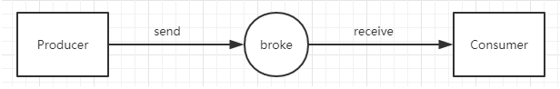

# active-mq

## active-mq

JMS即Java消息服务（Java Message Service）应用程序接口，是一个Java平台中关于面向消息中间件（MOM）的API，用于在两个应用程序之间，或分布式系统中发送消息，进行异步通信。Java消息服务是一个与具体平台无关的API，绝大多数MOM提供商都对JMS提供支持。

JMS的消息机制有2种模型，一种是队列的形式（Point to Point—）发送的消息只能被一个消费者消费；一种是订阅（Topic）模式，可以被多个订阅者订阅，订阅者都会接收到同样的消息。

而ActiveMQ就是对JMS的实现之一。

## ActiveMQ介绍

ActiveMQ是一种开源的基于JMS（Java Message Servie）规范的一种消息中间件的实现，ActiveMQ的设计目标是提供标准的、面向消息的、能够跨越多语言和多系统的应用集成消息通信中间件。

它为企业应用中消息传递提供高可用、出色性能、可扩展、稳定和安全保障。

ActiveMQ实现JMS规范并在此之上提供大量额外的特性。ActiveMQ支持队列和订阅两种模式的消息发送。

AcitveMQ的数据传送流程如下图：

ActiveMQ的两种消息传递类型：

- （1）点对点传输，即一个生产者对应一个消费者，生产者向broke推送数据，数据存储在broke的一个队列中，当消费者接受该条队列里的数据。

- （2）基于发布/订阅模式的传输，即根据订阅话题来接收相应数据，一个生产者可向多个消费者推送数据，与MQTT协议的实现是类似的。

两种消息传递类型的不同，点对点传输消费者可以接收到在连接之前生产者所推送的数据，而基于发布/订阅模式的传输方式消费者只能接收到连接之后生产者推送的数据。

## ActiveMQ的消息持久化机制

ActiveMQ的持久化机制包含

- JDBC： 持久化到数据库
- AMQ ：日志文件（已基本不用）
- KahaDB ： AMQ基础上改进，默认选择
- LevelDB ：谷歌K/V数据库

在activemq.xml中查看默认的broker持久化机制。

默认消息持久化到ActiveMQ路径下的data目录下。

## 实战

- [Spring Boot集成ActiveMQ](./active-mq-boot/ "Spring Boot集成ActiveMQ")
- [Spring MVC集成ActiveMQ](./active-mq-mvc/ "Spring MVC集成ActiveMQ")

## 其他事项

- 1、activeMq的端口号是61616；

- 2、使用topic,需要配置spring.jms.pub-sub-domain=true;

- 3、queue如果没有消费者，会将信息存储到queue中；

- 4、发送的消息为对象的时候，需要将对象序列化；消费者接收对象信息时需要使用ObjectMessage进行转化；

- 5、使用JmsListener注解中的containerFactory属性，可以配置spring.jms.pub-sub属性，实现同时接收queque和topic；

- 6、queue为点对点模式；topic为发布订阅模式；

- 7、示例中的消息队列名称（sms.queue和sms.topic）可根据需要设置成配置属性；

