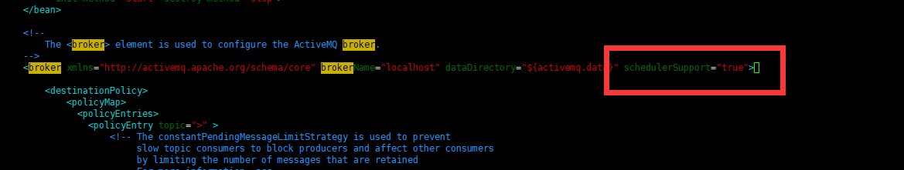

# active-mq-boot

Spring Boot针对ActiveMQ专门提供了spring-boot-starter-activemq，用来支持ActiveMQ在Spring Boot的自动集成配置。在此基础上我们可以很轻易的进行集成和使用。

## 添加依赖

pom.xml 添加依赖

```xml
<dependency>
	<groupId>org.springframework.boot</groupId>
	<artifactId>spring-boot-starter-activemq</artifactId>
</dependency>
```

此时如果不需要web或其他相关处理，只引入该依赖即可。如果使用pool的话, 就需要在pom中加入以下依赖：

```xml
<dependency>
     <groupId>org.apache.activemq</groupId>
     <artifactId>activemq-pool</artifactId>
</dependency>
```

## 配置文件

在*application.yml*中添加如下配置：

```yaml
spring:
  activemq:
    in-memory: true
```

其他配置
```
# 基于内存的ActiveMQ
spring.activemq.in-memory=true
# 不使用连接池，如果使用连接池还需在pom中添加activemq-pool的依赖spring.activemq.pool.enabled=false
# 独立安装的ActiveMQ
#spring.activemq.broker-url=tcp://127.0.0.1:61616
#spring.activemq.user=admin
#spring.activemq.password=admin
#信任所有的包
#spring.activemq.packages.trust-all=true
#是否替换默认的连接池，使用ActiveMQ的连接池需引入的依赖
#spring.activemq.pool.enabled=true
#连接池最大连接数
#spring.activemq.pool.max-connections=10
#空闲的连接过期时间，默认为30秒
#spring.activemq.pool.idle-timeout=30000
#强制的连接过期时间，与idleTimeout的区别在于：idleTimeout是在连接空闲一段时间失效，而expiryTimeout不管当前连接的情况，只要达到指定时间就失效。默认为0，never
#spring.activemq.pool.expiry-timeout=0
```

上述配置中有两套配置，Spring Boot支持基于内存ActiveMQ和基于独立安装的ActiveMQ。正常请求基于内存的形式是为了方便测试而使用，基于独立安装的形式才是真正用于生产环境。此处为了讲解功能，方便测试，采用基于内存的形式。

## 队列模式实例

首先，我们来实现基于队列（Queue）形式的实现。这里需要用到两个类`ActiveMQQueue`和`JmsMessagingTemplate`。前者是由ActiveMQ对`javax.jms.Queue`的接口实现。后者为Spring提供发送消息的工具类，结合Queue对消息进行发送。

`JmsMessagingTemplate`默认已经被实例化，直接拿来使用即可。而`ActiveMQQueue`则需要我们进行实例化，并传入消息队列的名称。

```java
import org.apache.activemq.command.ActiveMQQueue;
import org.springframework.context.annotation.Bean;
import org.springframework.context.annotation.Configuration;

import javax.jms.Queue;

/**
 * @ClassName ActiveMqConfig
 * @Description TODO
 * @Author zhua
 * @Date 2020/11/20 14:45
 * @Version 1.0
 */
@Configuration
public class ActiveMqConfig {

    /**
     * 点对点模式队列
     * @return
     */
    @Bean
    public Queue queue() {
        return new ActiveMQQueue("sms.queue");
    }
}
```

Spring Boot中很常规的实例化操作，不再赘述。当实例化完ActiveMQQueue之后，我们的队列便创建完成，下面创建对应的生产者和消费者。

生产者对应代码如下：

```java
import org.springframework.jms.core.JmsMessagingTemplate;
import org.springframework.stereotype.Component;

import javax.annotation.Resource;
import javax.jms.Queue;

/**
 * @ClassName ActiveMqProducer
 * @Description TODO
 * @Author zhua
 * @Date 2020/11/20 15:00
 * @Version 1.0
 */
@Component
public class ActiveMqProducer {

    @Resource
    private JmsMessagingTemplate jmsMessagingTemplate;
    @Resource
    private Queue queue;

    public void sendMsg(String msg) {
        System.out.println("发送消息内容 :" + msg);
        this.jmsMessagingTemplate.convertAndSend(this.queue, msg);
    }
}
```

此处用到JmsMessagingTemplate和Queue，上面已经提到，这两个类都已经完成了初始化。消费者对应的配置如下：

```java
import org.springframework.jms.annotation.JmsListener;
import org.springframework.stereotype.Component;

/**
 * @ClassName ActiveMqConsumer
 * @Description TODO
 * @Author zhua
 * @Date 2020/11/20 15:02
 * @Version 1.0
 */

@Component
public class ActiveMqConsumer {
    
//    destination对应配置类中ActiveMQQueue("springboot.queue")设置的名字
    @JmsListener(destination = "sms.queue")
    public void receiveMsg(String text) {
        System.out.println("接收到消息 : "+text);
    }
}
```

Spring提供了注解式监听器端点：使用`@JmsListener`。使用`@JmsListener`托管bean的带注释方法对其进行订阅。在Java8中，`@JmsListener`是一个可重复的注解，可以关联多个JMS destinations到同一个方法中。而在Java 6和7中，可以使用`@JmsListeners`注解。

其中destination指定监控的消息队列名称为“sms.queue”。当队列sms.queue中有消息发送时会触发此方法的执行，text为消息内容。

上面完成了队列初始化、生产者和消费者代码的编写，下面通过单元测试来验证是否能够正确发送和处理消息。

```java
import com.zhuaer.learning.mq.active.Application;
import com.zhuaer.learning.mq.active.handler.ActiveMqProducer;
import org.junit.Test;
import org.junit.runner.RunWith;
import org.springframework.beans.factory.annotation.Autowired;
import org.springframework.boot.test.context.SpringBootTest;
import org.springframework.test.context.junit4.SpringRunner;

/**
 * @ClassName ActiveMqTests
 * @Description TODO
 * @Author zhua
 * @Date 2020/11/20 15:04
 * @Version 1.0
 */
@RunWith(SpringRunner.class)
@SpringBootTest(classes = {Application.class})
public class ActiveMqTests {

    @Autowired
    private ActiveMqProducer activeMqProducer;

    @Test
    public void sendSimpleQueueMessage() {
        activeMqProducer.sendMsg("提现200.00元");
    }
}
```

执行单元测试，会发现在日志中打印如下信息：

```
发送消息内容 :提现200.00元
接收到消息 : 提现200.00元
```

说明消息可以正常发送和接收。如果是基于内存模式，在执行单元测试时会打印出“javax.jms.JMSException: peer (vm://localhost#1) stopped.”异常日志，这是Info级别的错误，是ActiveMQ的一个bug。

## 订阅模式实例

广播发送的消息，可以被多个消费者接收。这里我们就在原有的基础上进行广播消息的添加。

首先，Spring Boot集成ActiveMQ时默认只支持队列或者广播之一，通过配置项spring.jms.pub-sub-domain来指定，true 为广播模式，false为队列模式，默认情况下支持队列模式。

此时要使用广播模式，则需在配置文件中添加如下配置：

```yaml
spring:
  jms:
    pub-sub-domain: true    #false = Quene   true = Topic
```

需要注意的是，此时队列模式不可正常工作。

然后在ActiveMqConfig中添加：

```java
    /**
     * 发布/订阅模式
     * @return
     */
    @Bean
    public Topic topic() {
        return new ActiveMQTopic("sms.topic");
    }
```

这里创建了ActiveMQTopic，并将topic的名称指定为sms.topic。

ActiveMqProducer中新增如下代码：

```java
    @Resource
    private Topic topic;
    
    public void sendTopic(String msg) {
        System.out.println("发送Topic消息内容 :"+msg);
        this.jmsMessagingTemplate.convertAndSend(this.topic, msg);
    }
```

为了演示多个广播接收者，在ActiveMqConsumer中新增两个消费者：

```java
    @JmsListener(destination = "sms.topic")
    public void receiveTopic1(String text) {
        System.out.println("receiveTopic1接收到Topic消息 : " + text);
    }
    
    @JmsListener(destination = "sms.topic")
    public void receiveTopic2(String text) {
        System.out.println("receiveTopic2接收到Topic消息 : " + text);
    }
```

单元测试类中新增如下测试：

```java
    @Test
    public void sendSimpleTopicMessage() {
        activeMqProducer.sendTopic("提现200.00元");
    }
```

此时，执行单元测试，便可看到如下日志信息：

```
发送Topic消息内容 :提现200.00元
receiveTopic2接收到Topic消息 : 提现200.00元
receiveTopic1接收到Topic消息 : 提现200.00元
```

说明消息发送成功。

## 同时支持两种形式

在上面的实例中，要么支持队列模式要么支持广播模式，如果在生产环境中两者都需要支持，那么就需要自定义`JmsListenerContainerFactory`实例。当然，如果Spring Boot默认的配置无法满足需求，也可以自定义该类，这里只是其中场景之一。

基本配置和使用步骤：通过`DefaultJmsListenerContainerFactory`创建自定义的`JmsListenerContainerFactory`实例，在`@JmsListener`注解中通过`containerFactory`属性进行引用。

在ActiveMqConfig配置类中新增如下配置：

```java

    /**
     * 队列模式监听工厂
     * @param connectionFactory
     * @return
     */
    @Bean("queueListenerFactory")
    public JmsListenerContainerFactory<?> queueListenerFactory(ConnectionFactory connectionFactory) {
        DefaultJmsListenerContainerFactory factory = new DefaultJmsListenerContainerFactory();	factory.setConnectionFactory(connectionFactory);
        factory.setPubSubDomain(false);
        return factory;
    }

    /**
     * 广播订阅模式监听工厂
     * @param connectionFactory
     * @return
     */
    @Bean("topicListenerFactory")
    public JmsListenerContainerFactory<?> topicListenerFactory(ConnectionFactory connectionFactory) {
        DefaultJmsListenerContainerFactory factory = new DefaultJmsListenerContainerFactory();	factory.setConnectionFactory(connectionFactory);
        //设置为发布订阅方式, 默认情况下使用的生产消费者方式
        //这里必须设置为true，false则表示是queue类型
        factory.setPubSubDomain(true);
        return factory;
    }
```

这里分别实例化了基于队列和订阅的工厂类。然后分别在对应的消费者方法上添加containerFactory属性。示例代码如下：

```java
    //destination对应配置类中ActiveMQTopic("springboot.topic")设置的名字
    //containerFactory对应配置类中注册JmsListenerContainerFactory的bean名称
    @JmsListener(destination = "sms.queue", containerFactory = "queueListenerFactory")
    public void receiveMsg(String text) {
        System.out.println("接收到消息 : " + text);
    }
    
    @JmsListener(destination = "sms.topic", containerFactory = "topicListenerFactory")
    public void receiveTopic1(String text) {
        System.out.println("receiveTopic1接收到Topic消息 : " + text);
    }
```

分别执行两种形式的消息，发现都正常互利。同时，此时配置文件中的项`spring.jms.pub-sub-domain`也无效了。

## 延迟消息

首先在ActiveMQ的安装路径 /conf/activemq.xml 修改配置文件  增加：schedulerSupport="true"



然后保存重启服务

进入bin目录，执行 

```shell
./activemq restart
```

生产者修改

```java
/**
 * 延时发送
 *
 * @param destination 发送的队列
 * @param data        发送的消息
 * @param time        延迟时间
 */
public <T extends Serializable> void delaySend(Destination destination, T data, Long time) {
	Connection connection = null;
	Session session = null;
	MessageProducer producer = null;
	// 获取连接工厂
	ConnectionFactory connectionFactory = jmsMessagingTemplate.getConnectionFactory();
	try {
		// 获取连接
		connection = connectionFactory.createConnection();
		connection.start();
		// 获取session，true开启事务，false关闭事务
		session = connection.createSession(Boolean.TRUE, Session.AUTO_ACKNOWLEDGE);
		// 创建一个消息队列
		producer = session.createProducer(destination);
		producer.setDeliveryMode(JmsProperties.DeliveryMode.PERSISTENT.getValue());
		ObjectMessage message = session.createObjectMessage(data);
		//设置延迟时间
		message.setLongProperty(ScheduledMessage.AMQ_SCHEDULED_DELAY, time);
		// 发送消息
		producer.send(message);
		log.info("发送消息：{}", data);
		session.commit();
	} catch (Exception e) {
		e.printStackTrace();
	} finally {
		try {
			if (producer != null) {
				producer.close();
			}
			if (session != null) {
				session.close();
			}
			if (connection != null) {
				connection.close();
			}
		} catch (Exception e) {
			e.printStackTrace();
		}
	}
}
```

延时消息队列测试

```java
// 发送延迟消息
producer.delaySend(Producer.DEFAULT_QUEUE, "要发送的消息", 10000L);
```

