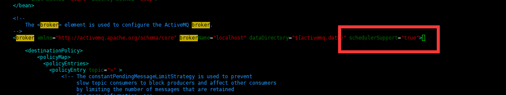

# active-mq-mvc

spring mvc 整合 activeMQ

## 添加依赖

```xml
<!-- activemq -->
<dependency>
	<groupId>org.springframework</groupId>
	<artifactId>spring-jms</artifactId>
	<version>5.0.2.RELEASE</version>
</dependency>
<dependency>
	<groupId>org.apache.activemq</groupId>
	<artifactId>activemq-pool</artifactId>
	<version>5.15.13</version>
</dependency>
```
## 配置属性文件(配置文件也要加入到spring配置管理中)

activemq.properties

```
activemq_url=tcp://192.168.0.102:61616
activemq_username=admin
activemq_password=admin
```

## 编写配置文件(需要把该配置加入Spring管理中)

```xml
<?xml version="1.0" encoding="UTF-8"?>
<beans xmlns="http://www.springframework.org/schema/beans"
       xmlns:xsi="http://www.w3.org/2001/XMLSchema-instance"
       xmlns:context="http://www.springframework.org/schema/context"
       xsi:schemaLocation="
        http://www.springframework.org/schema/beans http://www.springframework.org/schema/beans/spring-beans-3.2.xsd
        http://www.springframework.org/schema/context http://www.springframework.org/schema/context/spring-context-3.2.xsd
         ">

    <!--创建连接工厂对象-->
    <bean id="jmsFactory" class="org.apache.activemq.pool.PooledConnectionFactory" destroy-method="stop">
        <property name="connectionFactory">
            <!--真正可以产生Connection的ConnectionFactory,由对应的jms服务厂商提供-->
            <bean class="org.apache.activemq.ActiveMQConnectionFactory">
                <property name="brokerURL" value="${activemq_url}"/>
                <!--连接的账号密码，没有密码可以不写-->
                <property name="userName" value="${activemq_username}"/>
                <property name="password" value="${activemq_password}"/>
            </bean>
        </property>
        <!--最大连接数-->
        <property name="maxConnections" value="100"></property>
    </bean>

    <!--这个是队列目的地，点对点的-->
    <bean id="destinationQueue" class="org.apache.activemq.command.ActiveMQQueue">
        <!--queue是对应名字，这里根据自己的填写-->
        <constructor-arg index="0" value="queue"/>
    </bean>

    <!--这个是主题-->
    <bean id="destinationTopic" class="org.apache.activemq.command.ActiveMQTopic">
        <constructor-arg index="0" value="topic"/>
    </bean>

    <!--Spring提供的JMS工具类，进行消息发送、接收-->
    <bean id="jmsTemplate" class="org.springframework.jms.core.JmsTemplate">
        <property name="connectionFactory" ref="jmsFactory"/>
        <!--
        这里的值destinationQueue对应上面的<bean id="destinationQueue"
        如果这里的值写 destinationQueue 表示是队列
        如果这里的值写 destinationTopic 表示这个是主题
        以上可以根据具体的需要更改
        -->
        <property name="defaultDestination" ref="destinationQueue"/>
        <property name="messageConverter">
            <!--消息类型的转换-->
            <bean class="org.springframework.jms.support.converter.SimpleMessageConverter"/>
        </property>
    </bean>

    <!--配置监听程序,只需要启动生产者 消费者不用启动，自动会监听记录-->
    <bean id="jmsContainer" class="org.springframework.jms.listener.DefaultMessageListenerContainer">
        <property name="connectionFactory" ref="jmsFactory"/>
        <!--
        这里的值destinationQueue对应上面的<bean id="destinationQueue"
        如果这里的值写 destinationQueue 表示是队列消费监听
        如果这里的值写 destinationTopic 表示这个是主题消费监听
        以上可以根据具体的需要更改
        -->
        <property name="destination" ref="destinationQueue"/>
        <!--activeMessageListener是在上面配置的base-package="com.zhuaer.learning.mq.active.handler" 包下的监听类-->
        <property name="messageListener" ref="activeMessageListener"/>
    </bean>

</beans>
```

## 增加监听类  

```java
import org.springframework.stereotype.Component;

import javax.jms.JMSException;
import javax.jms.Message;
import javax.jms.MessageListener;
import javax.jms.TextMessage;

/**
 * @ClassName MessageListener
 * @Description 消息监听器
 * @Author zhua
 * @Date 2020/11/25 11:46
 * @Version 1.0
 */
@Component
public class ActiveMessageListener implements MessageListener {

    @Override
    public void onMessage(Message message) {
        if (null!=message && message instanceof TextMessage){
            TextMessage textMessage= (TextMessage) message;
            try {
                System.out.println(textMessage.getText());
            } catch (JMSException e) {
                e.printStackTrace();
            }
        }
    }
}
```

## 增加消息生产者

```java
import org.apache.activemq.ScheduledMessage;
import org.springframework.jms.core.JmsTemplate;
import org.springframework.web.context.ContextLoader;
import org.springframework.web.context.WebApplicationContext;

import javax.jms.TextMessage;

/**
 * @ClassName ActiveMessageProduce
 * @Description 消息生产者
 * @Author zhua
 * @Date 2020/11/25 11:48
 * @Version 1.0
 */
public class ActiveMessageProduce {

    private JmsTemplate jmsTemplate;

    public void send() {
        WebApplicationContext webctx = ContextLoader.getCurrentWebApplicationContext();
        this.jmsTemplate = (JmsTemplate) webctx.getBean("jmsTemplate");
        /*队列生产者*/
        jmsTemplate.send(session -> {
            TextMessage textMessage = session.createTextMessage("发送的消息内容");

            /**
             * 延迟投递
             * 首先在ActiveMQ的安装路径 /conf/activemq.xml 修改配置文件  增加：schedulerSupport="true"
             */
//            //延迟投递的时间 毫秒
//            textMessage.setLongProperty(ScheduledMessage.AMQ_SCHEDULED_DELAY,4000);
//            //重复投递的的时间间隔 毫秒
//            textMessage.setLongProperty(ScheduledMessage.AMQ_SCHEDULED_PERIOD,4000);
//            //重复投递的次数
//            textMessage.setIntProperty(ScheduledMessage.AMQ_SCHEDULED_REPEAT,3);
            return textMessage;
        });
    }
}
```

## 实现消息延迟投递和定时投递

首先在ActiveMQ的安装路径 /conf/activemq.xml 修改配置文件  增加：schedulerSupport="true"



然后保存重启服务

进入bin目录，执行 

```shell
./activemq restart
```

然后消息发送代码修改

```java
jmsTemplate.send(session -> {
	TextMessage textMessage = session.createTextMessage("发送的消息内容");

	/**
     * 延迟投递
     * 首先在ActiveMQ的安装路径 /conf/activemq.xml 修改配置文件  增加：schedulerSupport="true"
     */
	//延迟投递的时间 毫秒
	textMessage.setLongProperty(ScheduledMessage.AMQ_SCHEDULED_DELAY,4000);
	//重复投递的的时间间隔 毫秒
	textMessage.setLongProperty(ScheduledMessage.AMQ_SCHEDULED_PERIOD,4000);
	//重复投递的次数
	textMessage.setIntProperty(ScheduledMessage.AMQ_SCHEDULED_REPEAT,3);
	return textMessage;
});
```

