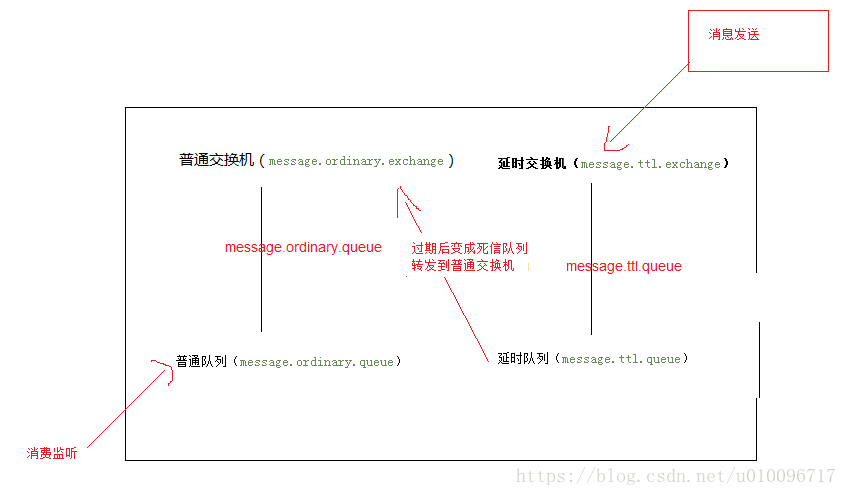

# mq-rabbit-delayed
rabbitMQ 延时队列

前言：在电商系统中，可能有这样一个需求，订单下单之后30分钟后，如果用户没有付钱，则系统自动取消订单。如果用常规的定时器定时去查询，这会造成很大的消耗（频繁访问数据库）。

这里选择RabbitMQ来实现类似的功能（使用队列的`TTL`特性）

这种模式大概流程，我们需要将消息先发送到`ttl`延迟队列内，当消息到达过期时间后会自动转发到`ttl`队列内配置的转发`Exchange`以及`RouteKey`绑定的队列内完成消息消费。

rabbitMQ延时队列的两个特性分不开的：

- Time To Live(TTL)

rabbitmq可以针对队列或者消息设置过期时间，如果超过时间，消息变为dead letter(死信)；如果两者同时设置，按照先到期的时间为准；

有两种方式，针对队列设置，那么队列中的消息的超时时间都是一样的；另外一种可以针对每条消息设置，每条消息的ttl值都不相同；

- Dead Letter Exchanges（DLX）

RabbitMQ的Queue可以配置`x-dead-letter-exchange` 和`x-dead-letter-routing-key`（可选）两个参数，如果队列内出现了dead letter，则按照这两个参数重新路由转发到指定的队列。

`x-dead-letter-exchange`：出现dead letter之后将dead letter重新发送到指定exchange
`x-dead-letter-routing-key`：出现dead letter之后将dead letter重新按照指定的routing-key发送

因此可以综合 这两个特点，设置了TTL规则之后当消息在一个队列中变成死信时，利用DLX特性它能被重新转发到另一个Exchange或者Routing Key，这时候消息就可以重新被消费了。

## 添加依赖

    <!-- 实现对 RabbitMQ 的自动化配置 -->
    <dependency>
    	<groupId>org.springframework.boot</groupId>
    	<artifactId>spring-boot-starter-amqp</artifactId>
    </dependency>

## springboot 自动化配置rabbitMQ，application.yml增加rabbit地址等配置

    spring:
      #配置rabbitMq 服务器
      rabbitmq:
        host: 127.0.0.1
        port: 5672
        username: root
        password: 123456
        #虚拟host 可以不设置,使用server默认host
        virtual-host: /user_center

## 定义延时交换机、队列

声明延时队列的时候可以根据实际情况设置延时队列时间

- 针对队列设置ttl值的情况

首先定义配置类，在里面定义两个队列，一个是ttl过期的队列，一个是过期后转发到exchange然后处理过期消息的队列

通过`x-dead-letter-exchange`设置队列的死信路由，那么出现dead letter之后将dead letter重新发送到指定exchange；

通过`x-dead-letter-routing-key`设置路由键：出现dead letter之后将dead letter重新按照指定的routing-key发送；

通过`x-message-ttl`设置队列的过期时间；

    @Configuration
    public class RabbitMQConfig {
    
        public static final String DELAY_EXCHANGE_NAME = "delay.queue.demo.business.exchange";
        public static final String DELAY_QUEUEA_NAME = "delay.queue.demo.business.queuea";
        public static final String DELAY_QUEUEB_NAME = "delay.queue.demo.business.queueb";
        public static final String DELAY_QUEUEA_ROUTING_KEY = "delay.queue.demo.business.queuea.routingkey";
        public static final String DELAY_QUEUEB_ROUTING_KEY = "delay.queue.demo.business.queueb.routingkey";
        public static final String DEAD_LETTER_EXCHANGE = "delay.queue.demo.deadletter.exchange";
        public static final String DEAD_LETTER_QUEUEA_ROUTING_KEY = "delay.queue.demo.deadletter.delay_10s.routingkey";
        public static final String DEAD_LETTER_QUEUEB_ROUTING_KEY = "delay.queue.demo.deadletter.delay_60s.routingkey";
        public static final String DEAD_LETTER_QUEUEA_NAME = "delay.queue.demo.deadletter.queuea";
        public static final String DEAD_LETTER_QUEUEB_NAME = "delay.queue.demo.deadletter.queueb";
    
        // 声明延时Exchange
        @Bean("delayExchange")
        public DirectExchange delayExchange(){
            return new DirectExchange(DELAY_EXCHANGE_NAME);
        }
    
        // 声明死信Exchange
        @Bean("deadLetterExchange")
        public DirectExchange deadLetterExchange(){
            return new DirectExchange(DEAD_LETTER_EXCHANGE);
        }
    
        // 声明延时队列A 延时10s
        // 并绑定到对应的死信交换机
        @Bean("delayQueueA")
        public Queue delayQueueA(){
            Map<String, Object> args = new HashMap<>(2);
            // x-dead-letter-exchange    这里声明当前队列绑定的死信交换机
            args.put("x-dead-letter-exchange", DEAD_LETTER_EXCHANGE);
            // x-dead-letter-routing-key  这里声明当前队列的死信路由key
            args.put("x-dead-letter-routing-key", DEAD_LETTER_QUEUEA_ROUTING_KEY);
            // x-message-ttl  声明队列的TTL
            args.put("x-message-ttl", 6000);
            return QueueBuilder.durable(DELAY_QUEUEA_NAME).withArguments(args).build();
        }
    
        // 声明延时队列B 延时 60s
        // 并绑定到对应的死信交换机
        @Bean("delayQueueB")
        public Queue delayQueueB(){
            Map<String, Object> args = new HashMap<>(2);
            // x-dead-letter-exchange    这里声明当前队列绑定的死信交换机
            args.put("x-dead-letter-exchange", DEAD_LETTER_EXCHANGE);
            // x-dead-letter-routing-key  这里声明当前队列的死信路由key
            args.put("x-dead-letter-routing-key", DEAD_LETTER_QUEUEB_ROUTING_KEY);
            // x-message-ttl  声明队列的TTL
            args.put("x-message-ttl", 60000);
            return QueueBuilder.durable(DELAY_QUEUEB_NAME).withArguments(args).build();
        }
    
        // 声明死信队列A 用于接收延时10s处理的消息
        @Bean("deadLetterQueueA")
        public Queue deadLetterQueueA(){
            return new Queue(DEAD_LETTER_QUEUEA_NAME);
        }
    
        // 声明死信队列B 用于接收延时60s处理的消息
        @Bean("deadLetterQueueB")
        public Queue deadLetterQueueB(){
            return new Queue(DEAD_LETTER_QUEUEB_NAME);
        }
    
        // 声明延时队列A绑定关系
        @Bean
        public Binding delayBindingA(@Qualifier("delayQueueA") Queue queue,
                                     @Qualifier("delayExchange") DirectExchange exchange){
            return BindingBuilder.bind(queue).to(exchange).with(DELAY_QUEUEA_ROUTING_KEY);
        }
    
        // 声明业务队列B绑定关系
        @Bean
        public Binding delayBindingB(@Qualifier("delayQueueB") Queue queue,
                                     @Qualifier("delayExchange") DirectExchange exchange){
            return BindingBuilder.bind(queue).to(exchange).with(DELAY_QUEUEB_ROUTING_KEY);
        }
    
        // 声明死信队列A绑定关系
        @Bean
        public Binding deadLetterBindingA(@Qualifier("deadLetterQueueA") Queue queue,
                                          @Qualifier("deadLetterExchange") DirectExchange exchange){
            return BindingBuilder.bind(queue).to(exchange).with(DEAD_LETTER_QUEUEA_ROUTING_KEY);
        }
    
        // 声明死信队列B绑定关系
        @Bean
        public Binding deadLetterBindingB(@Qualifier("deadLetterQueueB") Queue queue,
                                          @Qualifier("deadLetterExchange") DirectExchange exchange){
            return BindingBuilder.bind(queue).to(exchange).with(DEAD_LETTER_QUEUEB_ROUTING_KEY);
        }
    }

- 针对消息设置ttl值的情况

定义延时队列的时候不指定ttl过期时间，在发送消息的时候针对单个小时设置ttl过期时间

    public class RabbitMQConfig2 {
    
        public static final String DELAY_EXCHANGE_NAME = "delay.queue.demo.business.exchange";
        public static final String DELAY_QUEUEC_NAME = "delay.queue.demo.business.queuec";
        public static final String DELAY_QUEUEC_ROUTING_KEY = "delay.queue.demo.business.queuec.routingkey";
        public static final String DEAD_LETTER_EXCHANGE = "delay.queue.demo.deadletter.exchange";
        public static final String DEAD_LETTER_QUEUEC_ROUTING_KEY = "delay.queue.demo.deadletter.delay_anytime.routingkey";
        public static final String DEAD_LETTER_QUEUEC_NAME = "delay.queue.demo.deadletter.queuec";
    
        // 声明延时Exchange
        @Bean("delayExchange")
        public DirectExchange delayExchange(){
            return new DirectExchange(DELAY_EXCHANGE_NAME);
        }
    
        // 声明死信Exchange
        @Bean("deadLetterExchange")
        public DirectExchange deadLetterExchange(){
            return new DirectExchange(DEAD_LETTER_EXCHANGE);
        }
    
        // 声明延时队列C 不设置TTL
        // 并绑定到对应的死信交换机
        @Bean("delayQueueC")
        public Queue delayQueueC(){
            Map<String, Object> args = new HashMap<>(3);
            // x-dead-letter-exchange    这里声明当前队列绑定的死信交换机
            args.put("x-dead-letter-exchange", DEAD_LETTER_EXCHANGE);
            // x-dead-letter-routing-key  这里声明当前队列的死信路由key
            args.put("x-dead-letter-routing-key", DEAD_LETTER_QUEUEC_ROUTING_KEY);
            return QueueBuilder.durable(DELAY_QUEUEC_NAME).withArguments(args).build();
        }
    
        // 声明死信队列C 用于接收延时任意时长处理的消息
        @Bean("deadLetterQueueC")
        public Queue deadLetterQueueC(){
            return new Queue(DEAD_LETTER_QUEUEC_NAME);
        }
    
        // 声明延时列C绑定关系
        @Bean
        public Binding delayBindingC(@Qualifier("delayQueueC") Queue queue,
                                     @Qualifier("delayExchange") DirectExchange exchange){
            return BindingBuilder.bind(queue).to(exchange).with(DELAY_QUEUEC_ROUTING_KEY);
        }
    
        // 声明死信队列C绑定关系
        @Bean
        public Binding deadLetterBindingC(@Qualifier("deadLetterQueueC") Queue queue,
                                          @Qualifier("deadLetterExchange") DirectExchange exchange){
            return BindingBuilder.bind(queue).to(exchange).with(DEAD_LETTER_QUEUEC_ROUTING_KEY);
        }
    }

生产者发送消息

    @Autowired
    private RabbitTemplate rabbitTemplate;
    
    public void sendMsg(String msg, Integer delayTime){
    	rabbitTemplate.convertAndSend(RabbitMQConfig2.DELAY_EXCHANGE_NAME, RabbitMQConfig2.DELAY_QUEUEC_ROUTING_KEY, msg, a ->{
    		a.getMessageProperties().setDelay(delayTime);
    		return a;
    	});
    }
    
可以自定义了`ExpirationMessagePostProcessor`，来设置消息属性的ttl值

    public class ExpirationMessagePostProcessor implements MessagePostProcessor {
    
        private final String ttl;
    
        public ExpirationMessagePostProcessor(String ttl) {
            this.ttl = ttl;
        }
    
        @Override
        public Message postProcessMessage(Message message) throws AmqpException {
            message.getMessageProperties().setExpiration(ttl);
            return message;
        }
    }
    
