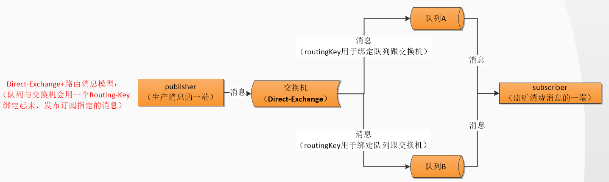

# mq-rabbit
springboot 自动化配置 rabbitMQ

# RabbitMQ 官网拜读

abbitMQ 其实核心就是围绕 “消息模型” 来展开的，其中就包括了组成消息模型的相关组件：生产者，消费者，队列，交换机，路由，消息等！而我们在实战应用中，实际上也是紧紧围绕着 “消息模型” 来展开撸码的！

官网地址：[http://www.rabbitmq.com/getstarted.html](http://www.rabbitmq.com/getstarted.html "http://www.rabbitmq.com/getstarted.html")

下面，我就介绍一下这一消息模型的演变历程，当然，这一历程在 RabbitMQ 官网也是可以窥览得到的！

上面几个图就已经概述了几个要点，而且，这几个要点的含义可以说是字如其名！

- 生产者：发送消息的程序
- 消费者：监听接收消费消息的程序
- 消息：一串二进制数据流
- 队列：消息的暂存区/存储区
- 交换机：消息的中转站，用于接收分发消息。其中有 fanout、direct、topic、headers 四种
- 路由：相当于密钥/第三者，与交换机绑定即可路由消息到指定的队列！

**核心概念**

- server：又称broker，接受客户端连接，实现AMQP实体服务。
- connection：连接和具体broker网络连接。
- channel：网络信道，几乎所有操作都在channel中进行，channel是消息读写的通道。客户端可以建立多个channel，每个channel表示一个会话任务。
- message：消息，服务器和应用程序之间传递的数据，由properties和body组成。properties可以对消息进行修饰，比如消息的优先级，延迟等高级特性；body是消息实体内容。
- Virtual host：虚拟主机，用于逻辑隔离，最上层消息的路由。一个Virtual host可以若干个Exchange和Queue，同一个Virtual host不能有同名的Exchange或Queue。
- Exchange：交换机，接受消息，根据路由键转发消息到绑定的队列上。
- banding：Exchange和Queue之间的虚拟连接，binding中可以包括routing key
- routing key：一个路由规则，虚拟机根据他来确定如何路由 一条消息。
- Queue：消息队列，用来存放消息的队列。

常用的交换机有以下三种，因为消费者是从队列获取信息的，队列是绑定交换机的（一般），所以对应的消息推送/接收模式也会有以下几种：

**Direct Exchange**

直连型交换机，根据消息携带的路由键将消息投递给对应队列。

大致流程，有一个队列绑定到一个直连交换机上，同时赋予一个路由键 routing key 。
然后当一个消息携带着路由值为X，这个消息通过生产者发送给交换机时，交换机就会根据这个路由值X去寻找绑定值也是X的队列。

**anout Exchange**

扇型交换机，这个交换机没有路由键概念，就算你绑了路由键也是无视的。 这个交换机在接收到消息后，会直接转发到绑定到它上面的所有队列。

**Topic Exchange**

主题交换机，这个交换机其实跟直连交换机流程差不多，但是它的特点就是在它的路由键和绑定键之间是有规则的。
简单地介绍下规则：

\*  (星号) 用来表示一个单词 (必须出现的)

\#  (井号) 用来表示任意数量（零个或多个）单词

通配的绑定键是跟队列进行绑定的，举个小例子
队列Q1 绑定键为 \*.TT.\*          队列Q2绑定键为  TT.#

如果一条消息携带的路由键为 A.TT.B，那么队列Q1将会收到；
如果一条消息携带的路由键为TT.AA.BB，那么队列Q2将会收到；

**主题交换机是非常强大的，为啥这么膨胀？**
当一个队列的绑定键为 "#"（井号） 的时候，这个队列将会无视消息的路由键，接收所有的消息。
当 * (星号) 和 # (井号) 这两个特殊字符都未在绑定键中出现的时候，此时主题交换机就拥有的直连交换机的行为。
所以主题交换机也就实现了扇形交换机的功能，和直连交换机的功能。

另外还有 Header Exchange 头交换机 ，Default Exchange 默认交换机，Dead Letter Exchange 死信交换机，这几个该篇暂不做讲述。

# SpringBoot 整合 RabbitMQ 实战

## 添加依赖

    <!-- 实现对 RabbitMQ 的自动化配置 -->
    <dependency>
    	<groupId>org.springframework.boot</groupId>
    	<artifactId>spring-boot-starter-amqp</artifactId>
    </dependency>
    
##  配置rabbitMq

完整配置查看：https://docs.spring.io/spring-boot/docs/2.1.3.RELEASE/reference/html/common-application-properties.html

    spring:
      application:
        name: @artifactId@
      #配置rabbitMq 服务器
      rabbitmq:
        host: 127.0.0.1
        port: 5672
        username: root
        password: 123456
        #虚拟host 可以不设置,使用server默认host
        virtual-host: /user_center
        # 开启发送确认
        publisher-confirm-type: correlated #必须配置这个才会确认回调
        # 开启发送失败退回
        publisher-returns: true
        listener:
          type: simple
          simple:
            acknowledge-mode: manual #手动确认
            prefetch: 1 #限制每次发送一条数据。
            concurrency: 3 #同一个队列启动几个消费者
            max-concurrency: 3 #启动消费者最大数量
            #重试策略相关配置
            retry:
              enabled: true #是否支持重试
              max-attempts: 5
              stateless: false
              #时间策略乘数因子
              multiplier: 1.0
              initial-interval: 1000ms
              max-interval: 10000ms
            default-requeue-rejected: true
    
            #完整配置查看：https://docs.spring.io/spring-boot/docs/2.1.3.RELEASE/reference/html/common-application-properties.html

ps：里面的虚拟virtual-host配置项不是必须的，我自己在rabbitmq服务上创建了自己的虚拟host，所以我配置了；你们不创建，就不用加这个配置项。    

## RabbitMQ Bean 简单配置    
我们需要以 Configuration 的方式配置 RabbitMQ 并以 Bean 的方式显示注入 RabbitMQ 在发送接收处理消息时相关 Bean 组件配置其中典型的配置是 RabbitTemplate 以及 SimpleRabbitListenerContainerFactory，前者是充当消息的发送组件，后者是用于管理  RabbitMQ监听器listener 的容器工厂

    import org.springframework.amqp.core.*;
    import org.springframework.amqp.rabbit.connection.CachingConnectionFactory;
    import org.springframework.amqp.rabbit.core.RabbitTemplate;
    import org.springframework.beans.factory.config.ConfigurableBeanFactory;
    import org.springframework.context.annotation.Bean;
    import org.springframework.context.annotation.Configuration;
    import org.springframework.context.annotation.Scope;
    
    /**
     * @ClassName TopicRabbitConfig
     * @Description RabbitMQ 简单配置
     * @Author zhua
     * @Date 2020/8/19 12:01
     * @Version 1.0
     */
    @Configuration
    public class SimpleRabbitMqConfig {
    
        final static String message = "topic.message";
        final static String messages = "topic.messages";
    
        /**
         * 队列
         * @return
         */
        @Bean
        public Queue queueMessage() {
            // durable:是否持久化,默认是false,持久化队列：会被存储在磁盘上，当消息代理重启时仍然存在，暂存队列：当前连接有效
            // exclusive:默认也是false，只能被当前创建的连接使用，而且当连接关闭后队列即被删除。此参考优先级高于durable
            // autoDelete:是否自动删除，当没有生产者或者消费者使用此队列，该队列会自动删除。
            //   return new Queue(SimpleRabbitMqConfig.message,true,true,false);
    
            return new Queue(SimpleRabbitMqConfig.message);
        }
    
        @Bean
        public Queue queueMessages() {
            return new Queue(SimpleRabbitMqConfig.messages);
        }
    
        /**
         * topic交换机
         * @return
         */
        @Bean
        TopicExchange topicExchange() {
            return new TopicExchange("topicExchange.hello");
        }
    
        /**
         * direct交换机
         * @return
         */
        @Bean
        DirectExchange directExchange() {
            return new DirectExchange("directExchange.hello",true,false);
        }
    
        /**
         * 绑定  将队列和交换机绑定, 并设置用于匹配键
         * @param queueMessage
         * @param topicExchange
         * @return
         */
        @Bean
        Binding bindingExchangeMessage(Queue queueMessage, TopicExchange topicExchange) {
            return BindingBuilder.bind(queueMessage).to(topicExchange).with("topic.message");
        }
    
        /**
         * 绑定  将队列和交换机绑定, 并设置用于匹配键
         * @param queueMessages
         * @param topicExchange
         * @return
         */
        @Bean
        Binding bindingExchangeMessages(Queue queueMessages, TopicExchange topicExchange) {
            return BindingBuilder.bind(queueMessages).to(topicExchange).with("topic.#");
        }
    
        /**
         * 如果需要在生产者需要消息发送后的回调，
         * 需要对rabbitTemplate设置ConfirmCallback对象，
         * 由于不同的生产者需要对应不同的ConfirmCallback，
         * 如果rabbitTemplate设置为单例bean，
         * 则所有的rabbitTemplate实际的ConfirmCallback为最后一次申明的ConfirmCallback。
         * @return
         */
        @Bean
        @Scope(ConfigurableBeanFactory.SCOPE_PROTOTYPE)
        public RabbitTemplate rabbitTemplate(CachingConnectionFactory connectionFactory) {
            RabbitTemplate template = new RabbitTemplate(connectionFactory);
            return template;
        }
    
    }

根据创建交换机的类型 `FanoutExchange`、`TopicExchange`、`DirectExchange` 类确认消息队列模式

## 发送消息

写个简单的接口进行消息推送，通过 `rabbitTemplate.convertAndSend` 推送消息。
> convertAndSend(exchange:交换机名称,routingKey:路由关键字,object:发送的消息内容,correlationData:消息ID)

    @RequestMapping("/send")
    @ResponseBody
    public void send() {
    	CorrelationData correlationId = new CorrelationData(UUID.randomUUID().toString());
    	String sendMsg = "hello1 " + new Date();
    	System.out.println("Sender : " + sendMsg);
    	//convertAndSend(exchange:交换机名称,routingKey:路由关键字,object:发送的消息内容,correlationData:消息ID)
    	rabbitTemplate.convertAndSend("exchange.hello","helloKey", sendMsg,correlationId);
    }

## 消费消息

使用 `@RabbitListener` 注解消费消息，可以同时监听多个队列

    /**
     * 监听某个队列的消息
     * @param message 接收到的消息
     */
    @RabbitListener(queues = "topic_queue")
    public void myListener(String message){
    	//不用在手动转UTF-8 Spring自动转好了
    	System.out.println(message);
    	log.debug("消费者接收到的消息为：{}", message);
    }
    
    /**
     * 监听某个队列的消息
     * @param message 接收到的消息
     */
    @SneakyThrows
    @RabbitListener(queues = "topic_queue")
    public void myListener(Message message , Channel channel){
    	log.info("receive: " + new String(message.getBody())+"《线程名：》"+Thread.currentThread().getName()+"《线程id:》"+Thread.currentThread().getId());
    	channel.basicAck(message.getMessageProperties().getDeliveryTag(), true);
    
    }
    
## 消息发送确认    

首先开启发送确认、发送失败退回，在application.yml配置 `publisher-confirm-type` 为 `correlated`，`publisher-returns` 为 `true`,如下

    # 开启发送确认
    publisher-confirm-type: correlated #必须配置这个才会确认回调
    # 开启发送失败退回
    publisher-returns: true

其次配置 RabbitTemplate, 重写 `RabbitTemplate.ConfirmCallback.confirm`、`RabbitTemplate.ReturnCallback.returnedMessage` 方法
可以通过全局配置方式，在配置文件里配置：

    import lombok.extern.slf4j.Slf4j;
    import org.springframework.amqp.core.Message;
    import org.springframework.amqp.rabbit.connection.CachingConnectionFactory;
    import org.springframework.amqp.rabbit.connection.CorrelationData;
    import org.springframework.amqp.rabbit.core.RabbitTemplate;
    import org.springframework.beans.factory.annotation.Autowired;
    import org.springframework.context.annotation.Bean;
    
    /**
     * @ClassName RabbitTemplateConfig
     * @Description TODO
     * @Author zhua
     * @Date 2020/8/20 14:14
     * @Version 1.0
     */
    @Slf4j
    public class RabbitTemplateConfig {
    
        @Autowired
        private CachingConnectionFactory connectionFactory;
        @Bean
        public RabbitTemplate rabbitTemplate() {
            //若使用confirm-callback ，必须要配置publisherConfirms 为true
            //connectionFactory.setPublisherConfirms(true);
            connectionFactory.setPublisherConfirmType(CachingConnectionFactory.ConfirmType.CORRELATED);
            //若使用return-callback，必须要配置publisherReturns为true
            connectionFactory.setPublisherReturns(true);
            RabbitTemplate rabbitTemplate = new RabbitTemplate(connectionFactory);
            //使用return-callback时必须设置mandatory为true，或者在配置中设置mandatory-expression的值为true
            // rabbitTemplate.setMandatory(true);
    
            // 如果消息没有到exchange,则confirm回调,ack=false; 如果消息到达exchange,则confirm回调,ack=true
            rabbitTemplate.setConfirmCallback(new RabbitTemplate.ConfirmCallback() {
                @Override
                public void confirm(CorrelationData correlationData, boolean ack, String cause) {
                    if (ack) {
                        log.info("消息发送成功:correlationData({}),ack({}),cause({})", correlationData, ack, cause);
                    } else {
                        log.info("消息发送失败:correlationData({}),ack({}),cause({})", correlationData, ack, cause);
                    }
                }
            });
    
            //如果exchange到queue成功,则不回调return;如果exchange到queue失败,则回调return(需设置mandatory=true,否则不回回调,消息就丢了)
            rabbitTemplate.setReturnCallback(new RabbitTemplate.ReturnCallback() {
                @Override
                public void returnedMessage(Message message, int replyCode, String replyText, String exchange, String routingKey) {
                    log.info("消息丢失:exchange({}),route({}),replyCode({}),replyText({}),message:{}", exchange, routingKey, replyCode, replyText, message);
                }
            });
            return rabbitTemplate;
        }
    }

也可以单独配置，在需要发送mq的地方单独配置：

1、构造方法注入设置，实现`RabbitTemplate.ConfirmCallback`,`RabbitTemplate.ReturnCallback`接口，重写`confirm`、`returnedMessage`方法

    import lombok.extern.slf4j.Slf4j;
    import org.springframework.amqp.core.Message;
    import org.springframework.amqp.rabbit.connection.CorrelationData;
    import org.springframework.amqp.rabbit.core.RabbitTemplate;
    import org.springframework.beans.factory.annotation.Autowired;
    import org.springframework.stereotype.Controller;
    import org.springframework.web.bind.annotation.RequestMapping;
    import org.springframework.web.bind.annotation.ResponseBody;
    
    import java.util.Date;
    import java.util.UUID;
    
    /**
     * @ClassName HelloSender
     * @Description 生产者
     * @Author zhua
     * @Date 2020/8/21 16:02
     * @Version 1.0
     */
    @Slf4j
    @Controller
    public class HelloSender implements RabbitTemplate.ConfirmCallback,RabbitTemplate.ReturnCallback{
    
    	private RabbitTemplate rabbitTemplate;
    
    	//构造方法注入
    	@Autowired
    	public HelloSender(RabbitTemplate rabbitTemplate) {
    		this.rabbitTemplate = rabbitTemplate;
    		//这是是设置回调能收到发送到响应
    		rabbitTemplate.setConfirmCallback(this);
    		//如果设置备份队列则不起作用
    		rabbitTemplate.setMandatory(true);
    		rabbitTemplate.setReturnCallback(this);
    	}
    
    	@RequestMapping("/send")
    	@ResponseBody
    	public void send() {
    		CorrelationData correlationId = new CorrelationData(UUID.randomUUID().toString());
    		String sendMsg = "hello1 " + new Date();
    		System.out.println("Sender : " + sendMsg);
    		//convertAndSend(exchange:交换机名称,routingKey:路由关键字,object:发送的消息内容,correlationData:消息ID)
    		rabbitTemplate.convertAndSend("exchange.hello","topic.message", sendMsg,correlationId);
    	}
    
    	//回调确认
    	@Override
    	public void confirm(CorrelationData correlationData, boolean ack, String cause) {
    		if(ack){
    			log.info("消息发送成功:correlationData({}),ack({}),cause({})",correlationData,ack,cause);
    		}else{
    			log.info("消息发送失败:correlationData({}),ack({}),cause({})",correlationData,ack,cause);
    		}
    	}
    
    	//消息发送到转换器的时候没有对列,配置了备份对列该回调则不生效
    	@Override
    	public void returnedMessage(Message message, int replyCode, String replyText, String exchange, String routingKey) {
    		log.info("消息丢失:exchange({}),route({}),replyCode({}),replyText({}),message:{}",exchange,routingKey,replyCode,replyText,message);
    	}
    }

2、初始化 Bean 之后设置，实现`InitializingBean`，重写 `afterPropertiesSet` 方法

    import lombok.extern.slf4j.Slf4j;
    import org.springframework.amqp.core.Message;
    import org.springframework.amqp.rabbit.connection.CorrelationData;
    import org.springframework.amqp.rabbit.core.RabbitTemplate;
    import org.springframework.beans.factory.InitializingBean;
    import org.springframework.beans.factory.annotation.Autowired;
    import org.springframework.stereotype.Controller;
    import org.springframework.web.bind.annotation.RequestMapping;
    import org.springframework.web.bind.annotation.ResponseBody;
    
    import java.util.Date;
    import java.util.UUID;
    
    /**
     * @ClassName HelloSender
     * @Description 生产者
     * @Author zhua
     * @Date 2020/8/21 16:02
     * @Version 1.0
     */
    @Slf4j
    @Controller
    public class HelloSender2 implements InitializingBean {
    	@Autowired
    	private RabbitTemplate rabbitTemplate;
    
    	@Override
    	public void afterPropertiesSet() throws Exception {
    		rabbitTemplate.setConfirmCallback(new RabbitConfirmCallBack());
    		rabbitTemplate.setReturnCallback(new RabbitReturnCallback());
    	}
    
    	@RequestMapping("/send")
    	@ResponseBody
    	public void send() {
    		CorrelationData correlationId = new CorrelationData(UUID.randomUUID().toString());
    		String sendMsg = "hello1 " + new Date();
    		System.out.println("Sender : " + sendMsg);
    		//convertAndSend(exchange:交换机名称,routingKey:路由关键字,object:发送的消息内容,correlationData:消息ID)
    		rabbitTemplate.convertAndSend("exchange.hello","topic.message", sendMsg,correlationId);
    	}
    
    	/**
    	 * 发送确认
    	 */
    	private class RabbitConfirmCallBack implements RabbitTemplate.ConfirmCallback {
    		@Override
    		public void confirm(CorrelationData correlationData, boolean ack, String cause) {
    			if(ack){
    				log.info("消息发送成功:correlationData({}),ack({}),cause({})",correlationData,ack,cause);
    			}else{
    				log.info("消息发送失败:correlationData({}),ack({}),cause({})",correlationData,ack,cause);
    			}
    		}
    	}
    
    	/**
    	 * 发送失败退回
    	 */
    	private class RabbitReturnCallback implements RabbitTemplate.ReturnCallback {
    		@Override
    		public void returnedMessage(Message message, int replyCode, String replyText, String exchange, String routingKey) {
    			log.info("消息丢失:exchange({}),route({}),replyCode({}),replyText({}),message:{}",exchange,routingKey,replyCode,replyText,message);
    		}
    	}
    }
    
## 消息消费手动确认

在application.yml配置手动确认

    acknowledge-mode: manual #手动确认
    
重写消息消费方法，传参多一个 `Channel channel`

    /**
     * 监听某个队列的消息
     * @param message 接收到的消息
     */
    @SneakyThrows
    @RabbitListener(queues = "topic_queue")
    public void myListener(Message message , Channel channel){
    	log.info("receive: " + new String(message.getBody())+"《线程名：》"+Thread.currentThread().getName()+"《线程id:》"+Thread.currentThread().getId());
    	channel.basicAck(message.getMessageProperties().getDeliveryTag(), true);
    
    }

channel.basicAck 给mq发送回调确认

### 自定义消费队列错误处理

@RabbitListener 注解`errorHandler`配置错误处理类

    /**
     * 监听某个队列的消息
     * @param message 接收到的消息
     */
    @SneakyThrows
    @RabbitListener(queues = "topic_queue",
    		// 注意此类为spring容器中的bean名称
    		errorHandler = "myReceiverListenerErrorHandler",
    		returnExceptions = "false")
    public void myListener(Message message , Channel channel){
    	log.info("receive: " + new String(message.getBody())+"《线程名：》"+Thread.currentThread().getName()+"《线程id:》"+Thread.currentThread().getId());
    	channel.basicAck(message.getMessageProperties().getDeliveryTag(), true);
    	try {
    		//告诉服务器收到这条消息 无需再发了 否则消息服务器以为这条消息没处理掉 后续还会在发
    		channel.basicAck(message.getMessageProperties().getDeliveryTag(),false);
    		log.info("receiver success");
    	} catch (IOException e) {
    		e.printStackTrace();
    		//丢弃这条消息
    		log.info("receiver fail");
    	}
    	throw new RuntimeException("业务异常");
    }
    
    @Component(value = "myReceiverListenerErrorHandler")
    public class MyReceiverListenerErrorHandler implements RabbitListenerErrorHandler {
    
    //        private static ConcurrentSkipListMap<Object, AtomicInteger> map = new ConcurrentSkipListMap();
    
    	/**
    	 */
    	@Override
    	public Object handleError(Message amqpMessage,
    							  org.springframework.messaging.Message <?> message,
    							  ListenerExecutionFailedException exception)
    			throws Exception {
    		log.error("消息接收发生了错误，消息内容:{},错误信息:{}",
    				JSON.toJSONString(message.getPayload()),
    				JSON.toJSONString(exception.getCause().getMessage()));
    		throw new AmqpRejectAndDontRequeueException("超出次数");
    	}
    }
    

# 补充

## Rabbitmq如何保证消息顺序执行

**1.为什么要保证顺序**

消息队列中的若干消息如果是对同一个数据进行操作，这些操作具有前后的关系，必须要按前后的顺序执行，否则就会造成数据异常。举例：
比如通过mysql binlog进行两个数据库的数据同步，由于对数据库的数据操作是具有顺序性的，如果操作顺序搞反，就会造成不可估量的错误。比如数据库对一条数据依次进行了 插入->更新->删除操作，这个顺序必须是这样，如果在同步过程中，消息的顺序变成了 删除->插入->更新，那么原本应该被删除的数据，就没有被删除，造成数据的不一致问题。

**2.出现顺序错乱的场景**

（1）rabbitmq

①一个queue，有多个consumer去消费，这样就会造成顺序的错误，consumer从MQ里面读取数据是有序的，但是每个consumer的执行时间是不固定的，无法保证先读到消息的consumer一定先完成操作，这样就会出现消息并没有按照顺序执行，造成数据顺序错误。

rabbitmq消息顺序错乱第一种情况示意图.png

②一个queue对应一个consumer，但是consumer里面进行了多线程消费，这样也会造成消息消费顺序错误。

abbitmq消息顺序错乱第二种情况示意图.png

（2）kafka

①kafka一个topic，一个partition，一个consumer，但是consumer内部进行多线程消费，这样数据也会出现顺序错乱问题。

kafka消息顺序错乱第一种情况示意图.png

②具有顺序的数据写入到了不同的partition里面，不同的消费者去消费，但是每个consumer的执行时间是不固定的，无法保证先读到消息的consumer一定先完成操作，这样就会出现消息并没有按照顺序执行，造成数据顺序错误。

kafka消息顺序错乱第二种情况示意图..png

**3.保证消息的消费顺序**

（1）rabbitmq

①拆分多个queue，每个queue一个consumer，就是多一些queue而已，确实是麻烦点；这样也会造成吞吐量下降，可以在消费者内部采用多线程的方式取消费。

一个queue对应一个consumer

②或者就一个queue但是对应一个consumer，然后这个consumer内部用内存队列做排队，然后分发给底层不同的worker来处理

一个queue对应一个consumer，采用多线程.png

（2）kafka

①确保同一个消息发送到同一个partition，一个topic，一个partition，一个consumer，内部单线程消费。

单线程保证顺序.png

②写N个内存queue，然后N个线程分别消费一个内存queue即可

多线程保证顺序.png