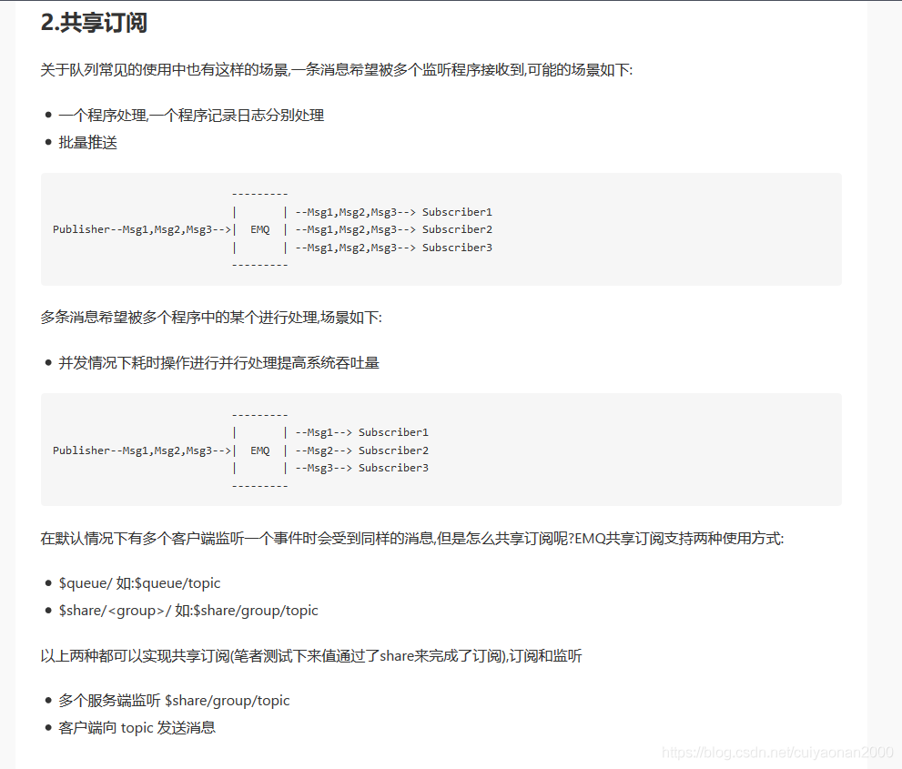

# MQTT

官方网址是:https://www.emqx.io/

MQTT（Message Queuing Telemetry Transport，消息队列遥测传输协议），是一种基于发布/订阅（publish/subscribe）模式的轻量级协议，该协议构建于TCP/IP协议之上，MQTT最大优点在于，可以以极少的代码和有限的带宽，为连接远程设备提供实时可靠的消息服务（这是特点）。作为一种低开销、低带宽占用的即时通讯协议，使其在物联网、小型设备、移动应用等方面有较广泛的应用。

　　MQTT是一个基于客户端-服务器的消息发布/订阅传输协议。MQTT协议是轻量、简单、开放和易于实现的，这些特点使它适用范围非常广泛。在很多情况下，包括受限的环境中，如：机器与机器（M2M）通信和物联网（IoT）。其在，通过卫星链路通信传感器、偶尔拨号的医疗设备、智能家居、及一些小型化设备中已广泛使用。（这是应用范围）　

 

MQTT协议工作在低带宽、不可靠的网络的远程传感器和控制设备通讯而设计的协议，它具有以下主要的几项特性：

- 使用发布/订阅消息模式，提供一对多的消息发布，解除应用程序耦合。（这不就是JMS么，这个的实时指令下达能否及时响应呢，现在看只是从带宽，网络的优势上选择了该技术）
- 对负载内容屏蔽的消息传输。
- 使用TCP/IP提供网络连接：主流的MQTT是基于TCP连接进行数据推送的，但是同样有基于UDP的版本，叫做MQTT-SN。这两种版本由于基于不同的连接方式，优缺点自然也就各有不同了。
- 有三种消息发布服务质量：“至多一次”，“至少一次”，“只有一次”
- 小型传输，开销很小（固定长度的头部是2字节），协议交换最小化，以降低网络流量。

MQTT协议中有三种身份：发布者（Publish）、代理（Broker）（服务器）、订阅者（Subscribe）。其中，消息的发布者和订阅者都是客户端，消息代理是服务器，消息发布者可以同时是订阅者。

　　MQTT传输的消息分为：主题（Topic）和负载（payload）两部分：

　　（1）Topic，可以理解为消息的类型，订阅者订阅（Subscribe）后，就会收到该主题的消息内容（payload）；

　　（2）payload，可以理解为消息的内容，是指订阅者具体要使用的内容。

# EMQ

EMQ 是一个百万级分布式开源物联网 MQTT 消息服务器（因为物联网使用MQTT的传输协议，相对应的是Netty，网上也说Netty也支持MQTT）

如下的EMQ,api地址：https://docs.emqx.net/broker/v3/cn/index.html


## Emq的问题
808协议是tcp场链接，车载终端根服务器实在一个tcp长连接上互相发送信息的。不会受到其它终端的干扰，因为链路是相互独立的。

- Emq是订阅发布的模式。所以客户端要给服务端发送指令，则客户端要发布一个主题，服务器端要订阅一个主题。反之服务端要给客户端发送指令，则服务端要发布一个指令，客户端要去订阅。（这个大家初次建立连接如何确定topic更好~）
- 另外如果举个例子：比如多个终端分别发送不同的主题，那后台使用通配符订阅了所有的终端，因为服务器肯定是集群，那是否会造成服务器重复消费数据的情况。（这个问题解决了方法如下截图）



- 主题订阅的通配符含义


## Emq推送方式的选择
- 客户端-客户端：客户端调用服务端接口成功后，直接通过客户端API发送消息到指定人的topic就好了(也可在创建协同或者上传文件接口中保存消息或者通过服务端订阅所有topic并将所有收到的topic消息落库)
- 服务端-客户端：服务端在上传接口或者创建协同的业务逻辑中保存并推送消息

## EMQ的Qos

接收消息的QoS级别，最终取决于发布消息的QoS和主题订阅的QoS. 具体参照如下:


Qos:0---------最多一次


Qos:1----------最少一次


Qos:2------------精准一次


## MQTT会话(Clean Session)
MQTT客户端向服务器发起CONNECT请求时，可以通过'Clean Session'标志设置会话。

'Clean Session'设置为0，表示创建一个持久会话，在客户端断开连接时，会话仍然保持并保存离线消息，直到会话超时注销。

'Clean Session'设置为1，表示创建一个新的临时会话，在客户端断开时，会话自动销毁。

## 离线消息（即publish时 订阅者不在线）的Retain插件
服务端收到 Retain 标志为 1 的 PUBLISH 报文时，会将该报文视为保留消息，除了被正常转发以外，保留消息会被存储在服务端，

每个主题下只能存在一份保留消息，因此如果已经存在相同主题的保留消息，则该保留消息被替换。-----------------只有收费的版本可以为每一个topic存储多个离线消息，否则最多只能收到一个topic

当客户端建立订阅时，如果服务端存在主题匹配的保留消息，则这些保留消息将被立即发送给该客户端。借助保留消息，新的订阅者能够立即获取最近的状态，而不需要等待无法预期的时间，这在很多场景下非常重要的。

EMQ X 默认开启保留消息的功能，可以在 etc/emqx.conf 中修改 mqtt.retain_available 为 false 以禁用保留消息功能。如果 EMQ X 在保留消息功能被禁用的情况下依然收到了保留消息，那么将返回原因码为 0x9A（不支持保留消息）的 DISCONNECT 报文。

## Retain相关插件配置------并不能改变每个topic只能保存一个消息的事实，只能从整体上控制下

emqx_retainer 插件默认开启，插件的配置路径为 etc/plugins/emqx_retainer.conf。


## Java调用EMQX的API

Emqx提供了很多API提供给程序使用。比如：我们可通过API获取所有当前的连接，并根据clientId来判断当前的在线车辆~~~~如下图所示


## Mqtt客户端的一些参数含义

```java
import org.fusesource.hawtbuf.Buffer;
import org.fusesource.hawtbuf.UTF8Buffer;
import org.fusesource.hawtdispatch.Dispatch;
import org.fusesource.hawtdispatch.DispatchQueue;
import org.fusesource.mqtt.client.BlockingConnection;
import org.fusesource.mqtt.client.Callback;
import org.fusesource.mqtt.client.CallbackConnection;
import org.fusesource.mqtt.client.FutureConnection;
import org.fusesource.mqtt.client.Listener;
import org.fusesource.mqtt.client.MQTT;
import org.fusesource.mqtt.client.Message;
import org.fusesource.mqtt.client.QoS;
import org.fusesource.mqtt.client.Topic;
import org.fusesource.mqtt.client.Tracer;
import org.fusesource.mqtt.codec.MQTTFrame;

/**
 * @ClassName MqttClient
 * @Description TODO
 * @Author zhua
 * @Date 2021/4/16 13:28
 * @Version 1.0
 */
public class MqttClient {
    public static void main(String[] args)
    {
        try {
            MQTT mqtt=new MQTT();

            //MQTT设置说明
            mqtt.setHost("tcp://10.1.58.191:1883");
            mqtt.setClientId("876543210"); //用于设置客户端会话的ID。在setCleanSession(false);被调用时，MQTT服务器利用该ID获得相应的会话。此ID应少于23个字符，默认根据本机地址、端口和时间自动生成
            mqtt.setCleanSession(false); //若设为false，MQTT服务器将持久化客户端会话的主体订阅和ACK位置，默认为true
            mqtt.setKeepAlive((short) 60);//定义客户端传来消息的最大时间间隔秒数，服务器可以据此判断与客户端的连接是否已经断开，从而避免TCP/IP超时的长时间等待
            mqtt.setUserName("admin");//服务器认证用户名
            mqtt.setPassword("admin");//服务器认证密码

            mqtt.setWillTopic("willTopic");//设置“遗嘱”消息的话题，若客户端与服务器之间的连接意外中断，服务器将发布客户端的“遗嘱”消息
            mqtt.setWillMessage("willMessage");//设置“遗嘱”消息的内容，默认是长度为零的消息
            mqtt.setWillQos(QoS.AT_LEAST_ONCE);//设置“遗嘱”消息的QoS，默认为QoS.ATMOSTONCE
            mqtt.setWillRetain(true);//若想要在发布“遗嘱”消息时拥有retain选项，则为true
            mqtt.setVersion("3.1.1");

            //失败重连接设置说明
            mqtt.setConnectAttemptsMax(10L);//客户端首次连接到服务器时，连接的最大重试次数，超出该次数客户端将返回错误。-1意为无重试上限，默认为-1
            mqtt.setReconnectAttemptsMax(3L);//客户端已经连接到服务器，但因某种原因连接断开时的最大重试次数，超出该次数客户端将返回错误。-1意为无重试上限，默认为-1
            mqtt.setReconnectDelay(10L);//首次重连接间隔毫秒数，默认为10ms
            mqtt.setReconnectDelayMax(30000L);//重连接间隔毫秒数，默认为30000ms
            mqtt.setReconnectBackOffMultiplier(2);//设置重连接指数回归。设置为1则停用指数回归，默认为2

            //Socket设置说明
            mqtt.setReceiveBufferSize(65536);//设置socket接收缓冲区大小，默认为65536（64k）
            mqtt.setSendBufferSize(65536);//设置socket发送缓冲区大小，默认为65536（64k）
            mqtt.setTrafficClass(8);//设置发送数据包头的流量类型或服务类型字段，默认为8，意为吞吐量最大化传输

            //带宽限制设置说明
            mqtt.setMaxReadRate(0);//设置连接的最大接收速率，单位为bytes/s。默认为0，即无限制
            mqtt.setMaxWriteRate(0);//设置连接的最大发送速率，单位为bytes/s。默认为0，即无限制

            //选择消息分发队列
            mqtt.setDispatchQueue(Dispatch.createQueue("foo"));//若没有调用方法setDispatchQueue，客户端将为连接新建一个队列。如果想实现多个连接使用公用的队列，显式地指定队列是一个非常方便的实现方法

            //设置跟踪器
            mqtt.setTracer(new Tracer(){
                @Override
                public void onReceive(MQTTFrame frame) {
                    System.out.println("recv: "+frame);
                }
                @Override
                public void onSend(MQTTFrame frame) {
                    System.out.println("send: "+frame);
                }
                @Override
                public void debug(String message, Object... args) {
                    System.out.println(String.format("debug: "+message, args));
                }
            });


            //使用回调式API
            final CallbackConnection callbackConnection=mqtt.callbackConnection();

            //连接监听
            callbackConnection.listener(new Listener() {

                //接收订阅话题发布的消息
                @Override
                public void onPublish(UTF8Buffer topic, Buffer payload, Runnable onComplete) {
                    System.out.println("=============receive msg================"+new String(payload.toByteArray()));
                    onComplete.run();
                }

                //连接失败
                @Override
                public void onFailure(Throwable value) {
                    System.out.println("===========connect failure===========");
                    callbackConnection.disconnect(null);
                }

                //连接断开
                @Override
                public void onDisconnected() {
                    System.out.println("====mqtt disconnected=====");

                }

                //连接成功
                @Override
                public void onConnected() {
                    System.out.println("====mqtt connected=====");

                }
            });


            //连接
            callbackConnection.connect(new Callback() {

                //连接失败
                public void onFailure(Throwable value) {
                    System.out.println("============连接失败："+value.getLocalizedMessage()+"============");
                }
                // 连接成功
                public void onSuccess(Void v) {
                    //订阅主题
                    Topic[] topics = {new Topic("foo", QoS.AT_LEAST_ONCE)};
                    callbackConnection.subscribe(topics, new Callback<byte[]>() {
                        //订阅主题成功
                        public void onSuccess(byte[] qoses) {
                            System.out.println("========订阅成功=======");
                        }
                        //订阅主题失败
                        public void onFailure(Throwable value) {
                            System.out.println("========订阅失败=======");
                            callbackConnection.disconnect(null);
                        }
                    });


                    //发布消息
                    callbackConnection.publish("foo", ("Hello ").getBytes(), QoS.AT_LEAST_ONCE, true, new Callback() {
                        public void onSuccess(Void v) {
                            System.out.println("===========消息发布成功============");
                        }
                        public void onFailure(Throwable value) {
                            System.out.println("========消息发布失败=======");
                            callbackConnection.disconnect(null);
                        }
                    });

                }
            });


            while(true)
            {

            }


        } catch (Exception e) {
            e.printStackTrace();
        }

    }
}
```