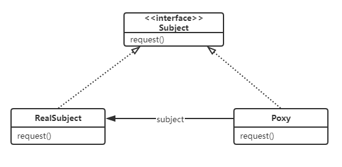
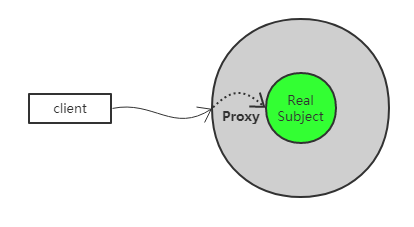
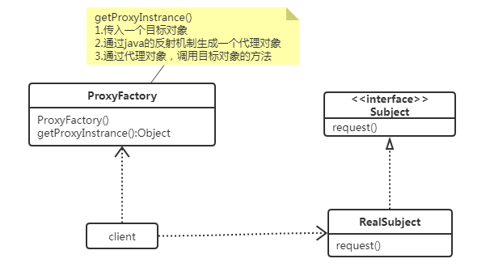
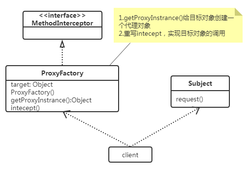
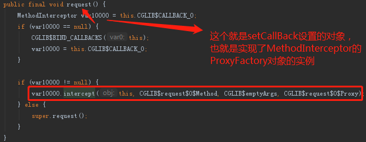

### 什么是代理模式
比较官方一点解释：**为另一对象提供一个替身或者占位符，以控制对这个对象的访问**，这句话看起来有一些比较难理解，那么下面我们用几个方便我们理解的场景去理解这句话；
- 追妹子
  > 曾经风华正茂的时候，是不是羞答答的喜欢过邻座的妹子；写情书或者送礼物的时候，总是会脸红心跳加不能呼吸，所以这个时候你往往就会怂恿你的好基友帮你传情书、递纸条、送礼物！！！那么这个替你追妹子的哥们儿就是你的**代理**；
- 打官司
   > 不管是都市剧还是现实生活中，会有一种代理律师的角色，他的职责就是帮你打官司，而你自己可以不用出庭，一切事务全权由代理律师帮你去办；

在理解上，我们可以按照上面的示例去理解，但是实际的开发过程中，会多多少少有些出入；但是核心思想基本就是这样了；代码实现，代理对象是持有的目标对象的引用，方法调用是由代理对象发起的，而真正的方法执行还有由目标对象去做的；代理对象只是在方法的前后增强了部分功能；回归的上面的例子；情书或者礼物是你自己准备的，哥们儿只是帮你转交一下，妹子看到的还是你的那份情书；最多的是哥们儿觉得你的礼物包装盒（信封）不好看，帮你重新再弄了一个更好看的盒子（充分）；

### 代理模式的UML图


### 代理模式的调用流程


### 代理的优点
- 可以在目标对象的基础上，对对象进行增强，即如上图所示，我们的客户端client调用RealSubject的时候，其实是经过了Proxy，因此我们可以在Proxy上对RealSubject进行增强，如：添加权限校验，添加参数校验等等

### 代理模式的形式
- 静态代理
- 动态代理
  - JDK动态代理
  - Cglib动态代理

#### 静态代理
- 什么是静态代理
  > Proxy是通过自己实现的代码对真实对象进行代理；静态代理在使用的时候，需要定义接口或者父类，目标对象和代理对象需要继承相同的接口或者继承相同的父类；下面以接口方式的代理解析静态代理的演示。
- 代码实现静态代理
  - 接口定义
    ```
    public interface Subject {
        public void request();
    }
    ```
  - 真实对象（RealSubject）实现
    ```
    public class RealSubject implements Subject {
      @Override
      public void request() {
          System.out.println("我是 RealSubject");
      }
    }
    ```
  - 代理对象（Proxy）实现
    ```
    public class Proxy implements Subject {
      private Subject subject;
      
      // 这里将需要代理的真实对象传递进来
      public Proxy(Subject subject) {
          this.subject = subject;
      }

      @Override
      public void request() {
          // 由于这一趴是自己写的，所以一旦接口增加方法，下面的这些增强的东西都需要再解析
          System.out.println("代码执行前增强！");
          try {
              // 调用真实对象中的方法
              subject.request();
              System.out.println("代码执行后增强！");
          } catch (Exception e) {
              System.out.println("代码执行异常！");
              // 由于这里只是代理，所以对异常处理完之后，还需要将其再抛出去
              throw e;
          }
          System.out.println("代码执行完！");
      }
    }
    ```
  - 测试方法
    ```
    public class test {
      public static void main(String[] args) {
          Subject subject = new Proxy(new RealSubject());
          subject.request();
      }
    }
    ```
    
- 优点
  - 在不修改目标对象的前提下对业务逻辑解析修改（这是所有的代理模式都有的优点）
  - **实现起来简单**；上面的代码可以看出，实现过程其实很简单。
  - **容易理解**；对于上面的代码，在理解上也很简单。
- 缺点
  - 目标对象和代理对象都需要实现相同的接口
  - **可维护性比较的弱**，如果代理增强的流程需要做修改，那么可能意味着所有的方法都得去做修改
  - 扩展性不强，每增加一个方法，我就需要单独去对代理对象进行处理；上面Proxy中对request的增强如果新加一个接口也需要的话，那么增强的代码必须再重新写一遍；为了解决这个问题，所以就出现了后面要降的**动态代理**。

#### 动态代理
为了解决前面静态代理中出现的大量手动档的重复代码；**提高代码的灵活性和可维护性**，就出现了一项新的代理方式--**动态代理**；何为动态代理？简单的理解就是Proxy的这个类不需要我们手动去写了，而是自动生成的！基于这个生成生成，就出现了两种方式：**JDK动态代理**和**Cglib动态代理**
##### JDK定代理
- 特点
  - 代理对象不再需要和目标对象一样实现接口
  - 目标对象依然需要实现接口，否则将无法进行动态代理
  - 代理对象的生成是利用JDK的API，在内存中动态的构建了一个代理对象
- UML图
 
  
- 代码实现
  - 接口
    ```
    public interface Subject {
      public void request();
    }
    ```
  - 真实对象RealSubject
    ```
    public class RealSubject implements Subject {
      @Override
      public void request() {
          System.out.println("我是 RealSubject");
      }
    } 
    ```
  - 代理工厂ProxyFactory
    ```
    import java.lang.reflect.InvocationHandler;
    import java.lang.reflect.Method;
    import java.lang.reflect.Proxy;

    public class ProxyFactory implements InvocationHandler {
        //真实的目标对象
        private Object target;

        /**
         * @param target 真实的目标对象
         */
        public ProxyFactory(Object target) {
            this.target = target;
        }

        public Object getProxyInstrance() {
            // 三个参数
            // 第一个：目标对象的类加载器  通过object.getClass().getClassLoader() 获取
            // 第二个：目标对象实现的接口
            // 第三个：事件处理，执行目标对象的方法时，会触发事件处理器方法(也就是InvocationHandler中的invoke)
            return Proxy.newProxyInstance(target.getClass().getClassLoader(), target.getClass().getInterfaces(), this);
        }

        @Override
        public Object invoke(Object proxy, Method method, Object[] args) throws Throwable {
            System.out.println("代码执行前增强！");
            Object returnObj;
            try {
                // 执行真实的目标对象的方法
                returnObj = method.invoke(target, args);
                    System.out.println("代码执行后增强！");
            } catch (Exception e) {
                System.out.println("代码执行异常！");
                // 由于这里只是代理，所以对异常处理完之后，还需要将其再抛出去
                throw e;
            }
            System.out.println("代码执行完！");
            return returnObj;
        }
    }
    ```
  - 客户端调用
    ```
    public class test {
        public static void main(String[] args) {
            // 设置参数，将生成的代理对象以文件的形式输出到com.sun.proxy.$Proxy0.class
            System.getProperties().put("sun.misc.ProxyGenerator.saveGeneratedFiles", "true");

            //生成目标对象
            Subject target = new RealSubject();
            //通过ProxyFactory生成代理对象
            Subject proxyObj = (Subject) new ProxyFactory(target).getProxyInstrance();
            //调用方法
            proxyObj.request();
        }
    }
    ``` 
    
  - 输出的代理对象
    ```
    // 开启输出
    System.getProperties().put("sun.misc.ProxyGenerator.saveGeneratedFiles", "true");
    在项目根目录的以下路径
    com.sun.proxy.$Proxy0.class
    ```
    
    
    
##### Cglib动态代理
不管是静态代理还是JDK的动态代理，我们都是基于接口实现的代理，但是实际开发过程中，往往也会存在一个单独的类，他并没有实现任何接口，这个时候，我们就可以使用目标对象的子类（抽象类）来实现代理；这种方式我们称之为Cglib代理
- 特点
   - Cglib又称之为**子类代理、抽象类代理**；它是在内存中构建一个子类从而实现对目标对象功能的扩展
   - Cglib是一个强大的高性能的代码生成包，它可以在运行时扩展java类与实现java接口，他被广泛用于许多Aop的框架中，如Spring Aop
   - Cglib包的底层是通过字节码处理器ASM来转换字节码并生成新的类
   - Cglib同样可也可以实现基于接口的动态代理
- 测试代码UML
  
- 代码实现
  - 引入资源
    ```
    <dependency>
        <groupId>cglib</groupId>
        <artifactId>cglib</artifactId>
        <version>3.2.10</version>
    </dependency>    
    ```
  - 普通类
    ```
    public class RealSubject {
        public void request() {
            System.out.println("我是 RealSubject");
        }
    }
    ```
  - 代理工厂对象
    ```
    import net.sf.cglib.proxy.Enhancer;
    import net.sf.cglib.proxy.MethodInterceptor;
    import net.sf.cglib.proxy.MethodProxy;

    import java.lang.reflect.Method;

    public class ProxyFactory implements MethodInterceptor {
        private Object target;
    
        public ProxyFactory(Object target) {
            this.target = target;
        }
    
        public Object getProxyInstrance() {
            //实例化Enhancer对象
            Enhancer enhancer = new Enhancer();
            //设置代理类拦截器 this指当前的Interceptor
            enhancer.setCallback(this);
            //如果目标对象是普通的类，这里就设置目标的对象为父类
            //设置当前的目标类为父类
            enhancer.setSuperclass(target.getClass());
            //如果目标对象实现了接口，我们要以接口去实现动态代理，就设置下面的接口参数
            //设置实现的接口 获取传入进来的对象的接口类
            //enhancer.setInterfaces(target.getClass().getInterfaces());
            //返回创建的对象
            return enhancer.create();
        }

        @Override
        public Object intercept(Object obj, Method method, Object[] args, MethodProxy proxy) throws Throwable {
            System.out.println("代码执行前增强！");
            Object returnObj;
            try {
                // 执行真实的目标对象的方法
                returnObj = method.invoke(target, args);
                System.out.println("代码执行后增强！");
            } catch (Exception e) {
                System.out.println("代码执行异常！");
                // 由于这里只是代理，所以对异常处理完之后，还需要将其再抛出去
                throw e;
            }
            System.out.println("代码执行完！");
            return returnObj;
       }
    }    
    ```
- 客户端调用
  - **基于普通类，以抽象类的方式代理**
    ```
    public class test {
        public static void main(String[] args) {
            //将生成的代理对象输出到指定的路径
            //E://logs为输出的路径
            System.setProperty(DebuggingClassWriter.DEBUG_LOCATION_PROPERTY, "E://logs");
            //目标对象
            RealSubject realSubject = new RealSubject();
            //生成代理对象
            RealSubject proxyObj = (RealSubject) new ProxyFactory(realSubject).getProxyInstrance();
            //调用方法
            proxyObj.request();
        }
    }
    ```
    
    > 由上图可以看出，是生成了一个叫`RealSubject$$EnhancerByCGLIB$$421f0be4`的代理类，他是继承了目标对象`RealSubject`，其中核心代码如下：
    
  - **基于接口的方式**
    ```
    public class test {
        public static void main(String[] args) {
            //将生成的代理对象输出到指定的路径
            System.setProperty(DebuggingClassWriter.DEBUG_LOCATION_PROPERTY, "E://logs");
            // 目标对象
            Subject realSubject = new RealSubject();
            // 代理对象
            Subject proxyObj = (Subject) new ProxyFactory(realSubject).getProxyInstrance();
            // 方法调用
            proxyObj.request();
        }
    }    
    ```
    
    > 类似于JDK动态代理，这里的代理对象和目标对象一样，也实现了相同的接口，核心的代理方法的实现和上面介于抽象类的方式差不多，可以仔细阅读一下生成的代理对象，就可以很轻松的理解其实现逻辑。
    
  
  
#### 代理模式的注意事项
- 动态代理不能代理私有方法（private）
  - 由于接口不能定义私有方法
  - 由于子类不能调用父类的私有方法
- final修饰的方法不能进行动态代理
- static修饰的方法不能进行动态代理
    
  