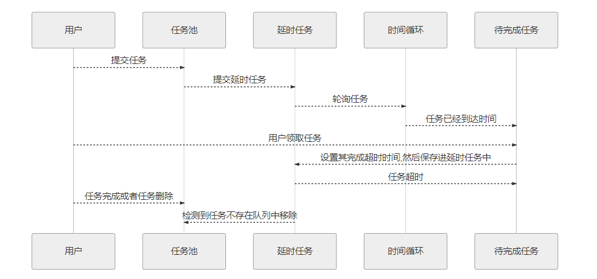

# redis-delayed

springboot redis 延时队列

有赞延迟队列设计：[https://tech.youzan.com/queuing_delay/](https://tech.youzan.com/queuing_delay/ "https://tech.youzan.com/queuing_delay/")

**业务流程**
1. 用户提交任务。首先将任务推送至延迟队列中。
2. 延迟队列接收到任务后，首先将任务推送至job pool中，然后计算其执行时间。
3. 然后生成延迟任务（仅仅包含任务id）放入某个桶中
4. 时间组件时刻轮询各个桶，当时间到达的时候从job pool中获得任务元信息。
5. 监测任务的合法性如果已经删除则pass。继续轮询。如果任务合法则再次计算时间
6. 如果合法则计算时间，如果时间合法：根据topic将任务放入对应的ready queue，然后从bucket中移除。如果时间不合法，则重新计算时间再次放入bucket，并移除之前的bucket中的内容
7. 消费端轮询对应topic的ready queue。获取job后做自己的业务逻辑。与此同时，服务端将已经被消费端获取的job按照其设定的TTR，重新计算执行时间，并将其放入bucket。
8. 完成消费后，发送finish消息，服务端根据job id删除对应信息。

**任务状态**
- ready：可执行状态，
- delay：不可执行状态，等待时钟周期。
- reserved：已被消费者读取，但没有完成消费。
- deleted：已被消费完成或者已被删除。

**对外提供的接口**

| 接口 | 描述         | 数据            |
| ------ | -------------- | ----------------- |
| add    | 添加任务   | Job数据         |
| pop    | 取出待处理任务 | topic就是任务分组 |
| finish | 完成任务   | 任务ID          |
| delete | 删除任务   | 任务ID          |

延迟队列可以通过Zset(有序列表实现)，Zset类似于java中SortedSet和HashMap的结合体，它是一个Set结构，保证了内部value值的唯一，同时他还可以给每个value设置一个score作为排序权重，Redis会根据score自动排序，我们每次拿到的就是最先需要被消费的消息，利用这个特性我们可以很好实现延迟队列。

## 添加依赖

    <!--springboot中的redis依赖-->
    <dependency>
    	<groupId>org.springframework.boot</groupId>
    	<artifactId>spring-boot-starter-data-redis</artifactId>
    </dependency>
    <dependency>
    	<groupId>org.apache.commons</groupId>
    	<artifactId>commons-pool2</artifactId>
    	<version>2.6.2</version>
    </dependency>

## application.yml 配置连接属性

    spring:
      application:
        name: @artifactId@
      redis:
        #Redis数据库索引（默认为0）
        database: 5
        host: 127.0.0.1
        password:
        port: 16379
        jedis:
          pool:
            # 连接池最大连接数（使用负值表示没有限制）
            max-active: 32
            # 连接池中的最大空闲连接
            max-idle: 20
            # 连接池中的最小空闲连接
            min-idle: 5
            # 连接池最大阻塞等待时间（使用负值表示没有限制）
            max-wait: 100ms
        lettuce:
          pool:
            max-active: 8
            max-idle: 8
            max-wait: -1ms
            min-idle: 0
          shutdown-timeout: 1000ms
        # 连接超时时间（毫秒）默认是2000ms
        timeout: 10000ms
     
## 实现

### 任务及相关对象

目前需要两个对象，一个是任务对象（job）一个负责保存任务引用的对象（delay job）

**任务对象**

    /**
     * @ClassName Job
     * @Description 任务对象
     * @Author zhua
     * @Date 2020/8/21 16:44
     * @Version 1.0
     */
    @Data
    @AllArgsConstructor
    @NoArgsConstructor
    public class Job implements Serializable {
    
        /**
         * 延迟任务的唯一标识，用于检索任务
         */
        @JsonSerialize(using = ToStringSerializer.class)
        private Long id;
    
        /**
         * 任务类型（具体业务类型）
         */
        private String topic;
    
        /**
         * 任务的延迟时间
         */
        private long delayTime;
    
        /**
         * 任务的执行超时时间
         */
        private long ttrTime;
    
        /**
         * 任务具体的消息内容，用于处理具体业务逻辑用
         */
        private String message;
    
        /**
         * 重试次数
         */
        private int retryCount;
        /**
         * 任务状态
         */
        private JobStatus status;
    }

**任务引用对象**

    /**
     * @ClassName DelayJob
     * @Description 延迟任务
     * @Author zhua
     * @Date 2020/8/21 16:49
     * @Version 1.0
     */
    @Data
    @AllArgsConstructor
    public class DelayJob implements Serializable {
        /**
         * 延迟任务的唯一标识
         */
        private long jodId;
    
        /**
         * 任务的执行时间
         */
        private long delayDate;
    
        /**
         * 任务类型（具体业务类型）
         */
        private String topic;
    
    
        public DelayJob(Job job) {
            this.jodId = job.getId();
            this.delayDate = System.currentTimeMillis() + job.getDelayTime();
            this.topic = job.getTopic();
        }
    
        public DelayJob(Object value, Double score) {
            this.jodId = Long.parseLong(String.valueOf(value));
            this.delayDate = System.currentTimeMillis() + score.longValue();
        }
    }
    
## 容器

目前我们需要完成三个容器的创建，Job任务池、延迟任务容器、待完成任务容器

**job任务池，为普通的K/V结构，提供基础的操作**

    /**
     * @ClassName JobPool
     * @Description job任务池
     * @Author zhua
     * @Date 2020/8/21 16:57
     * @Version 1.0
     */
    @Component
    @Slf4j
    public class JobPool {
    
        @Autowired
        private RedisTemplate redisTemplate;
    
        private String NAME = "job.pool";
    
        private BoundHashOperations getPool () {
            BoundHashOperations ops = redisTemplate.boundHashOps(NAME);
            return ops;
        }
    
        /**
         * 添加任务
         * @param job
         */
        public void addJob (Job job) {
            log.info("任务池添加任务：{}", JSON.toJSONString(job));
            getPool().put(job.getId(),job);
            return ;
        }
    
        /**
         * 获得任务
         * @param jobId
         * @return
         */
        public Job getJob(Long jobId) {
            Object o = getPool().get(jobId);
            if (o instanceof Job) {
                return (Job) o;
            }
            return null;
        }
    
        /**
         * 移除任务
         * @param jobId
         */
        public void removeDelayJob (Long jobId) {
            log.info("任务池移除任务：{}",jobId);
            // 移除任务
            getPool().delete(jobId);
        }
    }
    
**延迟任务，使用可排序的ZSet保存数据，提供取出最小值等操作**

    /**
     * @ClassName DelayBucket
     * @Description 延时处理队列
     * @Author zhua
     * @Date 2020/8/21 16:59
     * @Version 1.0
     */
    @Slf4j
    @Component
    public class DelayBucket {
    
        @Autowired
        private RedisTemplate redisTemplate;
    
        private static AtomicInteger index = new AtomicInteger(0);
    
        @Value("${thread.size}")
        private int bucketsSize;
    
        private List <String> bucketNames = new ArrayList <>();
    
        @Bean
        public List <String> createBuckets() {
            for (int i = 0; i < bucketsSize; i++) {
                bucketNames.add("bucket" + i);
            }
            return bucketNames;
        }
    
        /**
         * 获得桶的名称
         * @return
         */
        private String getThisBucketName() {
            int thisIndex = index.addAndGet(1);
            int i1 = thisIndex % bucketsSize;
            return bucketNames.get(i1);
        }
    
        /**
         * 获得桶集合
         * @param bucketName
         * @return
         */
        private BoundZSetOperations getBucket(String bucketName) {
            return redisTemplate.boundZSetOps(bucketName);
        }
    
        /**
         * 放入延时任务
         * @param job
         */
        public void addDelayJob(DelayJob job) {
            log.info("添加延迟任务:{}", JSON.toJSONString(job));
            String thisBucketName = getThisBucketName();
            BoundZSetOperations bucket = getBucket(thisBucketName);
            bucket.add(job,job.getDelayDate());
        }
    
        /**
         * 获得最新的延期任务
         * @return
         */
        public DelayJob getFirstDelayTime(Integer index) {
            String name = bucketNames.get(index);
            BoundZSetOperations bucket = getBucket(name);
            Set<ZSetOperations.TypedTuple> set = bucket.rangeWithScores(0, 1);
            if (CollectionUtils.isEmpty(set)) {
                return null;
            }
            ZSetOperations.TypedTuple typedTuple = (ZSetOperations.TypedTuple) set.toArray()[0];
            Object value = typedTuple.getValue();
            if (value instanceof DelayJob) {
                return (DelayJob) value;
            }
            return null;
        }
    
        /**
         * 移除延时任务
         * @param index
         * @param delayJob
         */
        public void removeDelayTime(Integer index,DelayJob delayJob) {
            String name = bucketNames.get(index);
            BoundZSetOperations bucket = getBucket(name);
            bucket.remove(delayJob);
        }
    }

**待完成任务，内部使用topic进行细分，每个topic对应一个list集合**

    /**
     * @ClassName ReadyQueue
     * @Description 待完成任务
     * @Author zhua
     * @Date 2020/8/21 16:59
     * @Version 1.0
     */
    @Component
    @Slf4j
    public class ReadyQueue {
    
        @Autowired
        private RedisTemplate redisTemplate;
    
        private String NAME = "process.queue";
    
        private String getKey(String topic) {
            return NAME + topic;
        }
    
        /**
         * 获得队列
         * @param topic
         * @return
         */
        private BoundListOperations getQueue (String topic) {
            BoundListOperations ops = redisTemplate.boundListOps(getKey(topic));
            return ops;
        }
    
        /**
         * 设置任务
         * @param delayJob
         */
        public void pushJob(DelayJob delayJob) {
            log.info("执行队列添加任务:{}",delayJob);
            BoundListOperations listOperations = getQueue(delayJob.getTopic());
            listOperations.leftPush(delayJob);
        }
    
        /**
         * 移除并获得任务
         * @param topic
         * @return
         */
        public DelayJob popJob(String topic) {
            BoundListOperations listOperations = getQueue(topic);
            Object o = listOperations.leftPop();
            if (o instanceof DelayJob) {
                log.info("执行队列取出任务:{}", JSON.toJSONString((DelayJob) o));
                return (DelayJob) o;
            }
            return null;
        }
    }
    
## 轮询处理

设置了线程池为每个bucket设置一个轮询操作

    /**
     * @ClassName DelayConfig
     * @Description 轮询处理
     * @Author zhua
     * @Date 2020/8/21 17:01
     * @Version 1.0
     */
    @Component
    public class DelayTimer implements ApplicationListener <ContextRefreshedEvent> {
    
        @Autowired
        private DelayBucket delayBucket;
        @Autowired
        private JobPool jobPool;
        @Autowired
        private ReadyQueue readyQueue;
        
        @Value("${thread.size}")
        private int length;
        
        @Override 
        public void onApplicationEvent(ContextRefreshedEvent contextRefreshedEvent) {
            ExecutorService executorService = new ThreadPoolExecutor(
                    length, 
                    length,
                    0L, TimeUnit.MILLISECONDS,
                    new LinkedBlockingQueue <Runnable>());
    
            for (int i = 0; i < length; i++) {
                executorService.execute(
                        new DelayJobHandler(
                                delayBucket,
                                jobPool,
                                readyQueue,
                                i));
            }
            
        }
    }

## 测试请求

    /**
     * @ClassName DelayController
     * @Description 测试
     * @Author zhua
     * @Date 2020/8/21 17:08
     * @Version 1.0
     */
    @RestController
    @RequestMapping("delay")
    public class DelayController {
    
        @Autowired
        private JobService jobService;
        /**
         * 添加
         * @param request
         * @return
         */
        @RequestMapping(value = "add",method = RequestMethod.POST)
        public String addDefJob(Job request) {
            DelayJob delayJob = jobService.addDefJob(request);
            return JSON.toJSONString(delayJob);
        }
    
        /**
         * 获取
         * @return
         */
        @RequestMapping(value = "pop",method = RequestMethod.GET)
        public String getProcessJob(String topic) {
            Job process = jobService.getProcessJob(topic);
            return JSON.toJSONString(process);
        }
    
        /**
         * 完成一个执行的任务
         * @param jobId
         * @return
         */
        @RequestMapping(value = "finish",method = RequestMethod.DELETE)
        public String finishJob(Long jobId) {
            jobService.finishJob(jobId);
            return "success";
        }
        
        /**
         * 任务的删除/消费
         * @param jobId
         * @return
         */
        @RequestMapping(value = "delete",method = RequestMethod.DELETE)
        public String deleteJob(Long jobId) {
            jobService.deleteJob(jobId);
            return "success";
        }
    }
