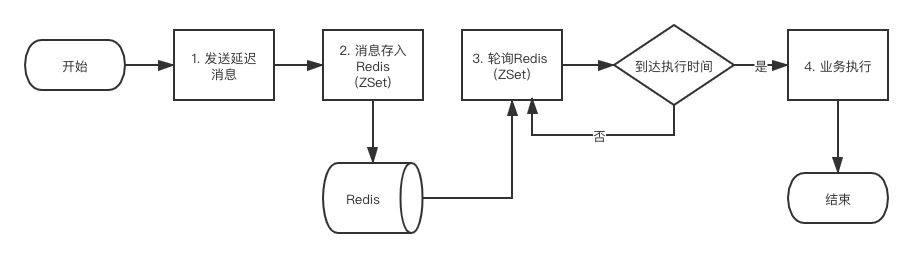
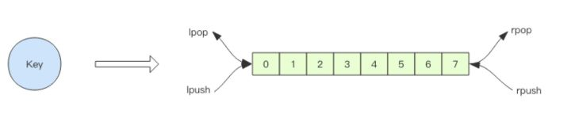

# redis-delayed2

springboot redis 延时队列

延迟队列可以通过Zset(有序列表实现)，Zset类似于java中SortedSet和HashMap的结合体，它是一个Set结构，保证了内部value值的唯一，同时他还可以给每个value设置一个score作为排序权重，Redis会根据score自动排序，我们每次拿到的就是最先需要被消费的消息，利用这个特性我们可以很好实现延迟队列。

**设计思路**：

1. 第一步将需要发放的消息发送到延迟队列中。

2. 延迟队列将数据存入 Redis 的 ZSet 有序集合中 score 为当前时间戳，member 存入需要发送的数据。

3. 添加一个 schedule 来进行对 Redis 有序队列的轮询。

4. 如果到达达到消息的执行时间，那么就进行业务的执行。

5. 如果没有达到消息的执行是将，那么消息等待下轮执行。

**异步消息队列基本实现**

Redis 的 list(列表) 数据结构常用来作为异步消息队列使用，使用 rpush/lpush 操作入队列， 使用 lpop 和 rpop 来出队列

**问题1**:如果队列空了

客户端是通过队列的 pop 操作来获取消息，然后进行处理。处理完了再接着获取消息， 再进行处理。如此循环往复，这便是作为队列消费者的客户端的生命周期。

可是如果队列空了，客户端就会陷入 pop 的死循环，不停地 pop，没有数据，接着再 pop， 又没有数据。这就是浪费生命的空轮询。空轮询不但拉高了客户端的 CPU，redis 的 QPS 也 会被拉高，如果这样空轮询的客户端有几十来个，Redis 的慢查询可能会显著增多。

通常我们使用 sleep 来解决这个问题，让线程睡一会，睡个 1s 钟就可以了。不但客户端 的 CPU 能降下来，Redis 的 QPS 也降下来了

**问题2**:队列延迟

用上面睡眠的办法可以解决问题。同时如果只有 1 个消费者，那么这个延迟就是 1s。如果有多个消费者，这个延迟会有所下降，因 为每个消费者的睡觉时间是岔开来的。

_有没有什么办法能显著降低延迟呢？_

那就是 `blpop`/`brpop`。

这两个指令的前缀字符 b 代表的是 blocking，也就是阻塞读。

阻塞读在队列没有数据的时候，会立即进入休眠状态，一旦数据到来，则立刻醒过来。消 息的延迟几乎为零。用 blpop/brpop 替代前面的 lpop/rpop，就完美解决了上面的问题。

**问题3**:空闲连接自动断开

其实他还有个问题需要解决—— 空闲连接的问题。

如果线程一直阻塞在哪里，Redis 的客户端连接就成了闲置连接，闲置过久，服务器一般 会主动断开连接，减少闲置资源占用。这个时候 blpop/brpop 会抛出异常来。

所以编写客户端消费者的时候要小心，注意捕获异常，还要重试。

## 添加依赖

    <!--springboot中的redis依赖-->
    <dependency>
    	<groupId>org.springframework.boot</groupId>
    	<artifactId>spring-boot-starter-data-redis</artifactId>
    </dependency>
    <dependency>
    	<groupId>org.apache.commons</groupId>
    	<artifactId>commons-pool2</artifactId>
    	<version>2.6.2</version>
    </dependency>

## application.yml 配置连接属性

    spring:
      application:
        name: @artifactId@
      redis:
        #Redis数据库索引（默认为0）
        database: 5
        host: 127.0.0.1
        password:
        port: 16379
        jedis:
          pool:
            # 连接池最大连接数（使用负值表示没有限制）
            max-active: 32
            # 连接池中的最大空闲连接
            max-idle: 20
            # 连接池中的最小空闲连接
            min-idle: 5
            # 连接池最大阻塞等待时间（使用负值表示没有限制）
            max-wait: 100ms
        lettuce:
          pool:
            max-active: 8
            max-idle: 8
            max-wait: -1ms
            min-idle: 0
          shutdown-timeout: 1000ms
        # 连接超时时间（毫秒）默认是2000ms
        timeout: 10000ms

## 添加延迟队列工具类

    /**
     * @ClassName RedisDelayedQueueT
     * @Description TODO
     * @Author zhua
     * @Date 2020/8/21 17:17
     * @Version 1.0
     */
    public class RedisDelayedQueueT<T> {
    
        private static final AtomicInteger COUNTER = new AtomicInteger(1);
    
        private volatile boolean started = false;
    
        private String queueKey;
    
        private Consumer<T> handler;
    
        private Class<T> classOfT;
    
        private StringRedisTemplate stringRedisTemplate;
    
        /**
         * @param queueKey 队列键值
         * @param classOfT 元素的类型
         * @param handler  处理器，如果元素到了时间，需要做的处理
         */
        public RedisDelayedQueueT(String queueKey, Class<T> classOfT, Consumer<T> handler) {
            this.queueKey = queueKey;
            this.handler = handler;
            this.classOfT = classOfT;
        }
    
        /**
         * 往该延时队列中放入数据,达到指定时间时处理
         *
         * @param value    数据
         * @param deadLine 截止时间戳，单位是毫秒
         * @return 是否执行成功
         */
        public boolean putForDeadLine(T value, long deadLine) {
            if (value == null) {
                return false;
            }
            long current = System.currentTimeMillis();
            if (deadLine < current) {
                throw new IllegalArgumentException(String.format("deadline: %d 小于当前时间: %d !", deadLine, current));
            }
            if (stringRedisTemplate == null) {
                throw new IllegalStateException("请设置stringRedisTemplate!");
            }
            String json = JSON.toJSONString(value);
            Boolean flag = stringRedisTemplate.opsForZSet().add(queueKey, json, deadLine);
            return Boolean.TRUE.equals(flag);
        }
    
        /**
         * 往该延时队列中放入数据,指定时间后执行
         *
         * @param value       数据
         * @param delayedTime 需要延长的时间，单位是毫秒
         * @return 是否执行成功
         */
        public boolean putForDelayedTime(T value, long delayedTime) {
            return putForDeadLine(value, System.currentTimeMillis() + delayedTime);
        }
    
        /**
         * 清除队列中的数据
         */
        public void clear() {
            stringRedisTemplate.opsForZSet().removeRangeByScore(queueKey, Double.MIN_VALUE, Double.MAX_VALUE);
        }
    
        /**
         * 验证队列是否存在 true 存在  false 不存在
         */
        public Boolean verify() {
            Long value = stringRedisTemplate.opsForZSet().zCard(queueKey);
            return value != null ? value > 0 : false;
        }
    
    
        public void setStringRedisTemplate(StringRedisTemplate stringRedisTemplate) {
            if (this.stringRedisTemplate == null && !started) {
                this.stringRedisTemplate = stringRedisTemplate;
                Worker worker = new Worker();
                worker.setName("delayed-queue-task-" + queueKey + "-" + COUNTER.getAndIncrement());
                worker.start();
                started = true;
            }
        }
    
        class Worker extends Thread {
    
            @Override
            public void run() {
                while (!Thread.currentThread().isInterrupted()) {
                    long current = System.currentTimeMillis();
                    Set<ZSetOperations.TypedTuple<String>> typedTuples = stringRedisTemplate.opsForZSet()
                            .rangeByScoreWithScores(queueKey, 0, current, 0, 1);
                    if (typedTuples != null && typedTuples.size() > 0) {
                        ZSetOperations.TypedTuple<String> next = typedTuples.iterator().next();
                        if (next.getScore() != null && next.getScore() < current) {
                            Long removedCount = stringRedisTemplate.opsForZSet().remove(queueKey, next.getValue());
                            // 只有一个线程可以删除成功，代表拿到了这个需要处理的数据
                            if (removedCount != null && removedCount > 0) {
                                handler.accept(JSON.parseObject(next.getValue(), classOfT));
                            }
                        }
                    }
                    try {
                        TimeUnit.MILLISECONDS.sleep(10L + ThreadLocalRandom.current().nextInt(10));
                    } catch (InterruptedException e) {
                        Thread.currentThread().interrupt();
                    }
                }
                started = false;
            }
        }
    }

## 使用

    /**
     * @ClassName RedisDelayedQueueTController
     * @Description TODO
     * @Author zhua
     * @Date 2020/8/21 17:20
     * @Version 1.0
     */
    @RestController
    @RequestMapping(value = "/test")
    public class RedisDelayedQueueTController {
    
        @Resource
        private StringRedisTemplate stringRedisTemplate;
    
    
        private RedisDelayedQueueT<String> redisDelayedQueue = new RedisDelayedQueueT<>("test-queue", String.class, this::head);
        /**
         * 异步执行方法
         * @param t
         * @param <T>
         */
        @Async
        public <T> void head(T t) {
            System.out.println("执行方法"+ JSON.toJSONString(t));
        }
    
    
        @GetMapping("/redisT")
        public String addTest(){
            redisDelayedQueue.setStringRedisTemplate(stringRedisTemplate);
            redisDelayedQueue.putForDelayedTime("测试延时定时任务",5000);
            return "success";
        }
    }

## 使用调用Lua脚本进一步优化

Lua 脚本, 如果有超时的消息, 就删除, 并返回这条消息, 否则返回空字符串:

    String luaScript = "local resultArray = redis.call('zrangebyscore', KEYS[1], 0, ARGV[1], 'limit' , 0, 1)\n" +
            "if #resultArray > 0 then\n" +
            "    if redis.call('zrem', KEYS[1], resultArray[1]) > 0 then\n" +
            "        return resultArray[1]\n" +
            "    else\n" +
            "        return ''\n" +
            "    end\n" +
            "else\n" +
            "    return ''\n" +
            "end";
    
    jedis.eval(luaScript, ScriptOutputType.VALUE, new String[]{key}, String.valueOf(System.currentTimeMillis()));
    
