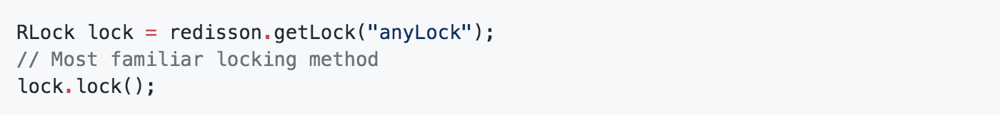
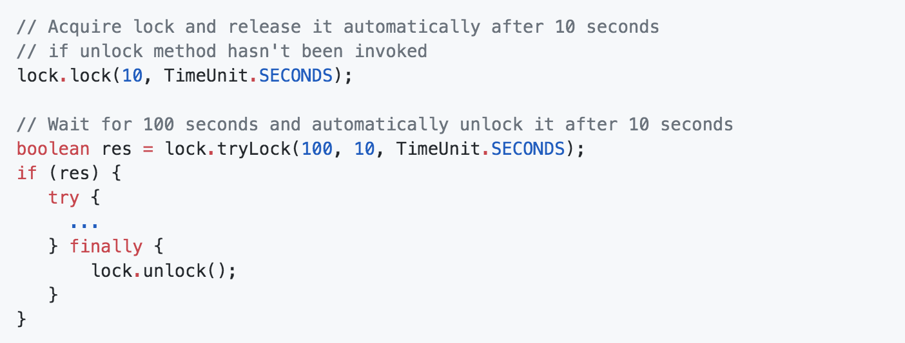
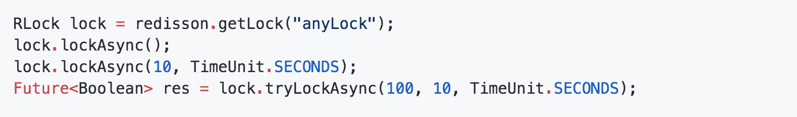
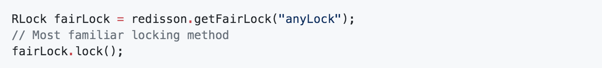
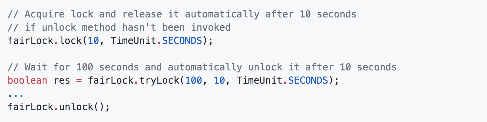
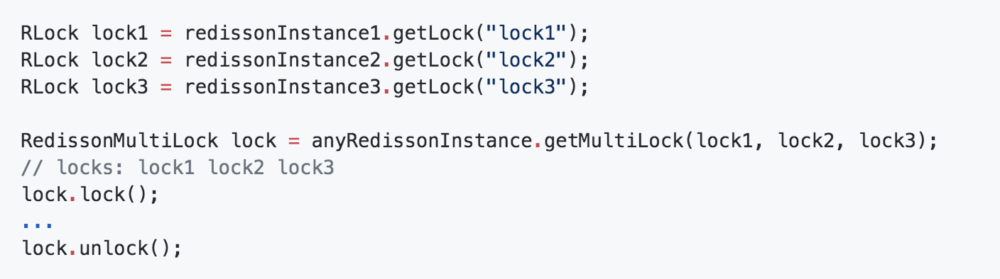
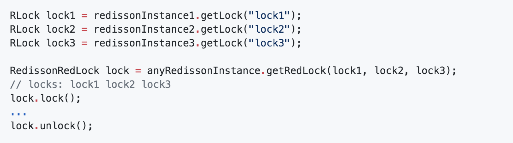

# redis-redisson

springboot 整合redisson，通过配置实现自动化效果

**Redisson功能**
   
   1、支持同步/异步/异步流/管道流方式连接
   
   2、多样化数据序列化
   
   3、集合数据分片
   
   4、分布式对象
   
   5、分布式集合
   
   6、分布式锁和同步器
   
   7、分布式服务
   
   8、独立节点模式
   
   9、三方框架整合

## 添加依赖

    <dependency>
    	<groupId>org.redisson</groupId>
    	<artifactId>redisson</artifactId>
    	<version>3.13.2</version>
    </dependency>

## application.yml 配置redis信息

官方文档：[https://github.com/redisson/redisson/wiki/%E7%9B%AE%E5%BD%95](https://github.com/redisson/redisson/wiki/%E7%9B%AE%E5%BD%95 "https://github.com/redisson/redisson/wiki/%E7%9B%AE%E5%BD%95")

redisson官方发布了redisson-spring-boot-starter，具体可以参考：[https://github.com/redisson/redisson/tree/master/redisson-spring-boot-starter#spring-boot-starter](https://github.com/redisson/redisson/tree/master/redisson-spring-boot-starter#spring-boot-starter "https://github.com/redisson/redisson/tree/master/redisson-spring-boot-starter#spring-boot-starter")

    redisson:
      address: redis://127.0.0.1:16379
      password:
      connection-pool-size: 10

    #  1、单机模式
    # redisson lock
    #  redisson.address=redis://127.0.0.1:6379
    #  redisson.password=
    
    #  2、哨兵模式
    #  redisson.master-name=mymaster
    #  redisson.password=xxxx
    #  redisson.sentinel-addresses=127.0.0.1:26379,127.0.0.1:26380,127.0.0.1:26381

扩充：

公平锁（Fair Lock）
基于Redis的Redisson分布式可重入公平锁也是实现了java.util.concurrent.locks.Lock接口的一种RLock对象。同时还提供了异步（Async）、反射式（Reactive）和RxJava2标准的接口。它保证了当多个Redisson客户端线程同时请求加锁时，优先分配给先发出请求的线程。所有请求线程会在一个队列中排队，当某个线程出现宕机时，Redisson会等待5秒后继续下一个线程，也就是说如果前面有5个线程都处于等待状态，那么后面的线程会等待至少25秒。

    RLock fairLock = redisson.getFairLock("anyLock");

// 最常见的使用方法

    fairLock.lock();

大家都知道，如果负责储存这个分布式锁的Redis节点宕机以后，而且这个锁正好处于锁住的状态时，这个锁会出现锁死的状态。为了避免这种情况的发生，Redisson内部提供了一个监控锁的看门狗，它的作用是在Redisson实例被关闭前，不断的延长锁的有效期。默认情况下，看门狗的检查锁的超时时间是30秒钟，也可以通过修改Config.lockWatchdogTimeout来另行指定。

另外Redisson还通过加锁的方法提供了leaseTime的参数来指定加锁的时间。超过这个时间后锁便自动解开了。

// 10秒钟以后自动解锁
// 无需调用unlock方法手动解锁

    fairLock.lock(10, TimeUnit.SECONDS);

// 尝试加锁，最多等待100秒，上锁以后10秒自动解锁

    boolean res = fairLock.tryLock(100, 10, TimeUnit.SECONDS);
    ...
    fairLock.unlock();

Redisson同时还为分布式可重入公平锁提供了异步执行的相关方法：

    RLock fairLock = redisson.getFairLock("anyLock");
    fairLock.lockAsync();
    fairLock.lockAsync(10, TimeUnit.SECONDS);
    Future<Boolean> res = fairLock.tryLockAsync(100, 10, TimeUnit.SECONDS);

## 新增redisson属性装配类

    /**
     * @ClassName RedissonProperties
     * @Description redisson属性装配类
     * @Author zhua
     * @Date 2020/7/17 18:33
     * @Version 1.0
     */
    @Data
    @ConfigurationProperties(prefix = "redisson")
    @ConditionalOnProperty("redisson.password")
    public class RedissonProperties {
    
        private int timeout = 3000;
    
        private String address;
    
        private String password;
    
        private int database = 0;
    
        private int connectionPoolSize = 64;
    
        private int connectionMinimumIdleSize=10;
    
        private int slaveConnectionPoolSize = 250;
    
        private int masterConnectionPoolSize = 250;
    
        private String[] sentinelAddresses;
    
        private String masterName;
    }

## SpringBoot自动装配类

    /**
     * @ClassName RedissonAutoConfiguration
     * @Description SpringBoot自动装配类
     * @Author zhua
     * @Date 2020/7/17 18:34
     * @Version 1.0
     */
    @Configuration
    @ConditionalOnClass(Config.class)
    @EnableConfigurationProperties(RedissonProperties.class)
    public class RedissonAutoConfiguration {
    
        @Autowired
        private RedissonProperties redssionProperties;
    
        /**
         * 哨兵模式自动装配 （哨兵模式跟单机模式配置其中之一）
         * @return
         */
        @Bean
        @ConditionalOnProperty(name="redisson.master-name")
        RedissonClient redissonSentinel() {
            Config config = new Config();
            SentinelServersConfig serverConfig = config.useSentinelServers().addSentinelAddress(redssionProperties.getSentinelAddresses())
                    .setMasterName(redssionProperties.getMasterName())
                    .setTimeout(redssionProperties.getTimeout())
                    .setMasterConnectionPoolSize(redssionProperties.getMasterConnectionPoolSize())
                    .setSlaveConnectionPoolSize(redssionProperties.getSlaveConnectionPoolSize());
    
            if(StringUtils.isNotBlank(redssionProperties.getPassword())) {
                serverConfig.setPassword(redssionProperties.getPassword());
            }
            return Redisson.create(config);
        }
    
        /**
         * 单机模式自动装配 （哨兵模式跟单机模式配置其中之一）
         * @return
         */
        @Bean
        @ConditionalOnProperty(name="redisson.address")
        RedissonClient redissonSingle() {
            Config config = new Config();
            SingleServerConfig serverConfig = config.useSingleServer()
                    .setAddress(redssionProperties.getAddress())
                    .setTimeout(redssionProperties.getTimeout())
                    .setConnectionPoolSize(redssionProperties.getConnectionPoolSize())
                    .setConnectionMinimumIdleSize(redssionProperties.getConnectionMinimumIdleSize());
    
            if(StringUtils.isNotBlank(redssionProperties.getPassword())) {
                serverConfig.setPassword(redssionProperties.getPassword());
            }
    
            return Redisson.create(config);
        }
    
        /**
         * 装配locker类，并将实例注入到RedissLockUtil中
         * @return
         */
        @Bean
        DistributedLocker distributedLocker(RedissonClient redissonClient) {
            DistributedLocker locker = new RedissonDistributedLocker(redissonClient);
            RedissLockUtil.setLocker(locker);
            return locker;
        }
    }

## 试用

**Lock**
默认，非公平锁

最简洁的一种方法

指定超时时间 

异步

**Fair Lock** 

**MultiLock**

**RedLock**

**分布式Object**

    RBucket<AnyObject> bucket = redisson.getBucket("anyObject");
    bucket.set(new AnyObject(1));
    AnyObject obj = bucket.get();
    bucket.trySet(new AnyObject(3));
    bucket.compareAndSet(new AnyObject(4), new AnyObject(5));
    bucket.getAndSet(new AnyObject(6));

**分布式BitSet**

    RBitSet set = redisson.getBitSet("simpleBitset");
    set.set(0, true);
    set.set(1812, false);
    set.clear(0);
    set.addAsync("e");
    set.xor("anotherBitset");
    
**分布式Lock**

    Redisson redisson = Redisson.create();
    RLock lock = redisson.getLock("anyLock");
    // Most familiar locking method
    lock.lock();
    // Lock time-to-live support
    // releases lock automatically after 10 seconds
    // if unlock method not invoked
    lock.lock(10, TimeUnit.SECONDS);
    // Wait for 100 seconds and automatically unlock it after 10 seconds
    boolean res = lock.tryLock(100, 10, TimeUnit.SECONDS);
    ...
    lock.unlock();

**分布式MultiLock**

    RLock lock1 = redissonInstance1.getLock("lock1");
    RLock lock2 = redissonInstance2.getLock("lock2");
    RLock lock3 = redissonInstance3.getLock("lock3");
    RedissonMultiLock lock = new RedissonMultiLock(lock1, lock2, lock3);
    lock.lock();

**分布式ReadWriteLock**

    RReadWriteLock rwlock = redisson.getLock("anyRWLock");
    // Most familiar locking method
    rwlock.readLock().lock();
    // or
    rwlock.writeLock().lock();
    // Lock time-to-live support
    // releases lock automatically after 10 seconds
    // if unlock method not invoked
    rwlock.readLock().lock(10, TimeUnit.SECONDS);
    // or
    rwlock.writeLock().lock(10, TimeUnit.SECONDS);
    // Wait for 100 seconds and automatically unlock it after 10 seconds
    boolean res = rwlock.readLock().tryLock(100, 10, TimeUnit.SECONDS);
    // or
    boolean res = rwlock.writeLock().tryLock(100, 10, TimeUnit.SECONDS);
    ...
    lock.unlock();

**分布式Semaphore**

    RSemaphore semaphore = redisson.getSemaphore("semaphore");
    semaphore.acquire();
    semaphore.acquire(23);
    semaphore.tryAcquire();
    semaphore.tryAcquire(23, TimeUnit.SECONDS);
    semaphore.release(10);
    semaphore.release();

**分布式AtomicLong**

    RAtomicLong atomicLong = redisson.getAtomicLong("myAtomicLong");
    atomicLong.set(3);
    atomicLong.incrementAndGet();
    atomicLong.get();

**分布式AtomicDouble**

    RAtomicDouble atomicDouble = redisson.getAtomicDouble("myAtomicDouble");
    atomicDouble.set(2.81);
    atomicDouble.addAndGet(4.11);
    atomicDouble.get();

**分布式CountDownLatch**

    RCountDownLatch latch = redisson.getCountDownLatch("anyCountDownLatch");
    latch.trySetCount(1);
    latch.await();
    // in other thread or other JVM
    RCountDownLatch latch = redisson.getCountDownLatch("anyCountDownLatch");
    latch.countDown();

**Topic**

    RTopic<SomeObject> topic = redisson.getTopic("anyTopic");
    topic.addListener(new MessageListener<SomeObject>() {
        @Override
        public void onMessage(String channel, SomeObject message) {
            //...
        }
    });
    // in other thread or JVM
    RTopic<SomeObject> topic = redisson.getTopic("anyTopic");
    long clientsReceivedMessage = topic.publish(new SomeObject());

**Topic patttern**

    // subscribe to all topics by `topic1.*` pattern
    RPatternTopic<Message> topic1 = redisson.getPatternTopic("topic1.*");
    int listenerId = topic1.addListener(new PatternMessageListener<Message>() {
        @Override
        public void onMessage(String pattern, String channel, Message msg) {
             Assert.fail();
        }
    });

**分布式集合**
**分布式Map**
除此之外，还支持Multimap，这里不列出

    RMap<String, SomeObject> map = redisson.getMap("anyMap");
    SomeObject prevObject = map.put("123", new SomeObject());
    SomeObject currentObject = map.putIfAbsent("323", new SomeObject());
    SomeObject obj = map.remove("123");
    map.fastPut("321", new SomeObject());
    map.fastRemove("321");
    Future<SomeObject> putAsyncFuture = map.putAsync("321");
    Future<Void> fastPutAsyncFuture = map.fastPutAsync("321");
    map.fastPutAsync("321", new SomeObject());
    map.fastRemoveAsync("321");

**Map eviction**

现在Redis没有过期清空Map中的某个entry的功能，只能是清空Map所有的entry。Redission提供了这种功能。

    RMapCache<String, SomeObject> map = redisson.getMapCache("anyMap");
    // ttl = 10 minutes, 
    map.put("key1", new SomeObject(), 10, TimeUnit.MINUTES);
    // ttl = 10 minutes, maxIdleTime = 10 seconds
    map.put("key1", new SomeObject(), 10, TimeUnit.MINUTES, 10, TimeUnit.SECONDS);
    // ttl = 3 seconds
    map.putIfAbsent("key2", new SomeObject(), 3, TimeUnit.SECONDS);
    // ttl = 40 seconds, maxIdleTime = 10 seconds
    map.putIfAbsent("key2", new SomeObject(), 40, TimeUnit.SECONDS, 10, TimeUnit.SECONDS);

**分布式Set**

    RSet<SomeObject> set = redisson.getSet("anySet");
    set.add(new SomeObject());
    set.remove(new SomeObject());
    
除此之外还有，还支持Set eviction， SortedSet, ScoredSortedSet, LexSortedSet
    
**分布式List**

    RList<SomeObject> list = redisson.getList("anyList");
    list.add(new SomeObject());
    list.get(0);
    list.remove(new SomeObject());

**分布式Blocking Queue**

    RBlockingQueue<SomeObject> queue = redisson.getBlockingQueue("anyQueue");
    queue.offer(new SomeObject());
    SomeObject obj = queue.peek();
    SomeObject someObj = queue.poll();
    SomeObject ob = queue.poll(10, TimeUnit.MINUTES);

除此之外，还支持Queue, Deque, Blocking Deque

**其他功能**
**执行批量命令**

    RBatch batch = redisson.createBatch();
    batch.getMap("test").fastPutAsync("1", "2");
    batch.getMap("test").fastPutAsync("2", "3");
    batch.getMap("test").putAsync("2", "5");
    batch.getAtomicLongAsync("counter").incrementAndGetAsync();
    batch.getAtomicLongAsync("counter").incrementAndGetAsync();
    List<?> res = batch.execute();
