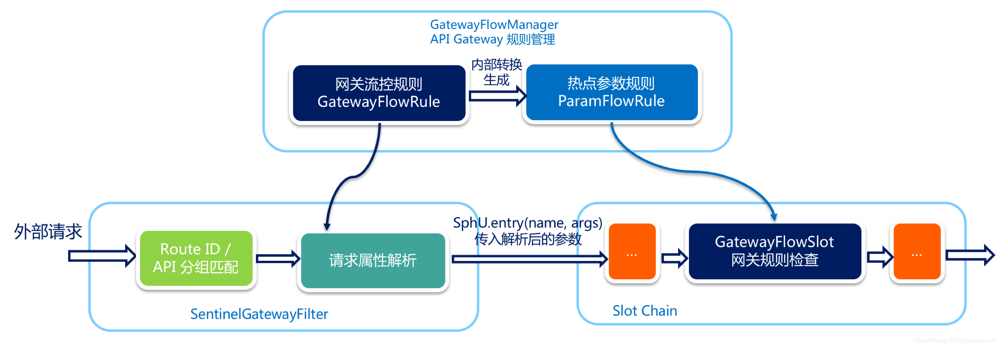

# sentinel-gateway
Sentinel 支持对 Spring Cloud Gateway、Zuul 等主流的 API Gateway 进行限流。

Sentinel 1.6.0 引入了 Sentinel API Gateway Adapter Common 模块，此模块中包含网关限流的规则和自定义 API 的实体和管理逻辑：
- `GatewayFlowRule`：网关限流规则，针对 API Gateway 的场景定制的限流规则，可以针对不同 route 或自定义的 API 分组进行限流，支持针对请求中的参数、Header、来源 IP 等进行定制化的限流。
- `ApiDefinition`：用户自定义的 API 定义分组，可以看做是一些 URL 匹配的组合。比如我们可以定义一个 API 叫 my_api，请求 path 模式为 /foo/** 和 /baz/** 的都归到 my_api 这个 API 分组下面。限流的时候可以针对这个自定义的 API 分组维度进行限流。

其中网关限流规则 `GatewayFlowRule` 的字段解释如下：
- `resource`：资源名称，可以是网关中的 route 名称或者用户自定义的 API 分组名称。
- `resourceMode`：规则是针对 API Gateway 的 route（RESOURCE_MODE_ROUTE_ID）还是用户在 Sentinel 中定义的 API 分组（RESOURCE_MODE_CUSTOM_API_NAME），默认是 route。
- `grade`：限流指标维度，同限流规则的 grade 字段。
- `count`：限流阈值
- `intervalSec`：统计时间窗口，单位是秒，默认是 1 秒。
- `controlBehavior`：流量整形的控制效果，同限流规则的 controlBehavior 字段，目前支持快速失败和匀速排队两种模式，默认是快速失败。
- `burst`：应对突发请求时额外允许的请求数目。
- `maxQueueingTimeoutMs`：匀速排队模式下的最长排队时间，单位是毫秒，仅在匀速排队模式下生效。
- `paramItem`：参数限流配置。若不提供，则代表不针对参数进行限流，该网关规则将会被转换成普通流控规则；否则会转换成热点规则。其中的字段：
	1. parseStrategy：从请求中提取参数的策略，目前支持提取来源 IP（PARAM_PARSE_STRATEGY_CLIENT_IP）、Host（PARAM_PARSE_STRATEGY_HOST）、任意 Header（PARAM_PARSE_STRATEGY_HEADER）和任意 URL 参数（PARAM_PARSE_STRATEGY_URL_PARAM）四种模式。
	2. fieldName：若提取策略选择 Header 模式或 URL 参数模式，则需要指定对应的 header 名称或 URL 参数名称。
	3. pattern：参数值的匹配模式，只有匹配该模式的请求属性值会纳入统计和流控；若为空则统计该请求属性的所有值。（1.6.2 版本开始支持）
	4. matchStrategy：参数值的匹配策略，目前支持精确匹配（PARAM_MATCH_STRATEGY_EXACT）、子串匹配（PARAM_MATCH_STRATEGY_CONTAINS）和正则匹配（PARAM_MATCH_STRATEGY_REGEX）。（1.6.2 版本开始支持）

用户可以通过 `GatewayRuleManager.loadRules(rules)` 手动加载网关规则，或通过 `GatewayRuleManager.register2Property(property)` 注册动态规则源动态推送（推荐方式）。

## 网关流控实现原理

当通过 GatewayRuleManager 加载网关流控规则（GatewayFlowRule）时，无论是否针对请求属性进行限流，Sentinel 底层都会将网关流控规则转化为热点参数规则（ParamFlowRule），存储在GatewayRuleManager 中，与正常的热点参数规则相隔离。转换时 Sentinel 会根据请求属性配置，为网关流控规则设置参数索引（idx），并同步到生成的热点参数规则中。

外部请求进入 API Gateway 时会经过 Sentinel 实现的 filter，其中会依次进行 路由/API 分组匹配、请求属性解析和参数组装。Sentinel 会根据配置的网关流控规则来解析请求属性，并依照参数索引顺序组装参数数组，最终传入SphU.entry(res, args) 中。Sentinel API Gateway Adapter Common 模块向 Slot Chain 中添加了一个 GatewayFlowSlot，专门用来做网关规则的检查。GatewayFlowSlot 会从GatewayRuleManager中提取生成的热点参数规则，根据传入的参数依次进行规则检查。若某条规则不针对请求属性，则会在参数最后一个位置置入预设的常量，达到普通流控的效果。

## Spring Cloud Gateway

从 1.6.0 版本开始，Sentinel 提供了 Spring Cloud Gateway 的适配模块，可以提供两种资源维度的限流：
- route 维度：即在 Spring 配置文件中配置的路由条目，资源名为对应的 routeId
- 自定义 API 维度：用户可以利用 Sentinel 提供的 API 来自定义一些 API 分组

使用时需引入以下模块（以 Maven 为例）：

    <dependency>
        <groupId>com.alibaba.csp</groupId>
        <artifactId>sentinel-spring-cloud-gateway-adapter</artifactId>
        <version>x.y.z</version>
    </dependency>

使用时只需注入对应的 `SentinelGatewayFilter` 实例以及 `SentinelGatewayBlockExceptionHandler` 实例即可。比如：

    @Configuration
    public class GatewayConfiguration {
    
        private final List<ViewResolver> viewResolvers;
        private final ServerCodecConfigurer serverCodecConfigurer;
    
        public GatewayConfiguration(ObjectProvider<List<ViewResolver>> viewResolversProvider,
                                    ServerCodecConfigurer serverCodecConfigurer) {
            this.viewResolvers = viewResolversProvider.getIfAvailable(Collections::emptyList);
            this.serverCodecConfigurer = serverCodecConfigurer;
        }
    
        @Bean
        @Order(Ordered.HIGHEST_PRECEDENCE)
        public SentinelGatewayBlockExceptionHandler sentinelGatewayBlockExceptionHandler() {
            // Register the block exception handler for Spring Cloud Gateway.
            return new SentinelGatewayBlockExceptionHandler(viewResolvers, serverCodecConfigurer);
        }
    
        @Bean
        @Order(Ordered.HIGHEST_PRECEDENCE)
        public GlobalFilter sentinelGatewayFilter() {
            return new SentinelGatewayFilter();
        }
    }

比如我们在 Spring Cloud Gateway 中配置了以下路由：

    server:
      port: 8090
    spring:
      application:
        name: spring-cloud-gateway
      cloud:
        gateway:
          enabled: true
          discovery:
            locator:
              lower-case-service-id: true
          routes:
            # Add your routes here.
            - id: product_route
              uri: lb://product
              predicates:
                - Path=/product/**
            - id: httpbin_route
              uri: https://httpbin.org
              predicates:
                - Path=/httpbin/**
              filters:
                - RewritePath=/httpbin/(?<segment>.*), /$\{segment}

同时自定义了一些 API 分组：

    private void initCustomizedApis() {
        Set<ApiDefinition> definitions = new HashSet<>();
        ApiDefinition api1 = new ApiDefinition("some_customized_api")
            .setPredicateItems(new HashSet<ApiPredicateItem>() {{
                add(new ApiPathPredicateItem().setPattern("/product/baz"));
                add(new ApiPathPredicateItem().setPattern("/product/foo/**")
                    .setMatchStrategy(SentinelGatewayConstants.URL_MATCH_STRATEGY_PREFIX));
            }});
        ApiDefinition api2 = new ApiDefinition("another_customized_api")
            .setPredicateItems(new HashSet<ApiPredicateItem>() {{
                add(new ApiPathPredicateItem().setPattern("/ahas"));
            }});
        definitions.add(api1);
        definitions.add(api2);
        GatewayApiDefinitionManager.loadApiDefinitions(definitions);
    }

那么这里面的 route ID（如 product_route）和 API name（如 some_customized_api）都会被标识为 Sentinel 的资源。比如访问网关的 URL 为 http://localhost:8090/product/foo/22 的时候，对应的统计会加到 product_route 和 some_customized_api 这两个资源上面，而 http://localhost:8090/httpbin/json 只会对应到 httpbin_route 资源上面。

您可以在 GatewayCallbackManager 注册回调进行定制：

- setBlockHandler：注册函数用于实现自定义的逻辑处理被限流的请求，对应接口为 BlockRequestHandler。默认实现为 DefaultBlockRequestHandler，当被限流时会返回类似于下面的错误信息：Blocked by Sentinel: FlowException。

## 网关流控控制台

Sentinel 1.6.3 引入了网关流控控制台的支持，用户可以直接在 Sentinel 控制台上查看 API Gateway 实时的 route 和自定义 API 分组监控，管理网关规则和 API 分组配置。

在 API Gateway 端，用户只需要在原有启动参数的基础上添加如下[启动参数](https://github.com/alibaba/Sentinel/wiki/%E6%8E%A7%E5%88%B6%E5%8F%B0#32-%E9%85%8D%E7%BD%AE%E5%90%AF%E5%8A%A8%E5%8F%82%E6%95%B0 "启动参数")即可标记应用为 API Gateway 类型：

>  注：通过 Spring Cloud Alibaba Sentinel 自动接入的 API Gateway 整合则无需此参数
>  -Dcsp.sentinel.app.type=1

添加正确的启动参数并有访问量后，我们就可以在 Sentinel 上面看到对应的 API Gateway 了。

## 自定义降级配置

    /**
     * 配置SentinelGatewayBlockExceptionHandler，限流后异常处理
     * @return
     */
    @Bean
    @Order(Ordered.HIGHEST_PRECEDENCE)
    public JsonSentinelGatewayBlockExceptionHandler sentinelGatewayBlockExceptionHandler() {
    	//return new SentinelGatewayBlockExceptionHandler(views, configurer);
    	return new JsonSentinelGatewayBlockExceptionHandler(viewResolvers, serverCodecConfigurer);
    }
    
JsonSentinelGatewayBlockExceptionHandler配置

     import java.nio.charset.StandardCharsets;
     import java.util.List;
     
     import org.springframework.core.io.buffer.DataBuffer;
     import org.springframework.http.codec.HttpMessageWriter;
     import org.springframework.http.codec.ServerCodecConfigurer;
     import org.springframework.http.server.reactive.ServerHttpResponse;
     import org.springframework.web.reactive.function.server.ServerResponse;
     import org.springframework.web.reactive.result.view.ViewResolver;
     import org.springframework.web.server.ServerWebExchange;
     import org.springframework.web.server.WebExceptionHandler;
     
     import com.alibaba.csp.sentinel.adapter.gateway.sc.callback.GatewayCallbackManager;
     import com.alibaba.csp.sentinel.slots.block.BlockException;
     import com.alibaba.csp.sentinel.util.function.Supplier;
     
     import reactor.core.publisher.Mono;
     /**
      * @ClassName JsonSentinelGatewayBlockExceptionHandler
      * @Description TODO
      * @Author zhua
      * @Date 2020/9/5 15:44
      * @Version 1.0
      */
     
     public class JsonSentinelGatewayBlockExceptionHandler implements WebExceptionHandler {
     
         private List<ViewResolver> viewResolvers;
         private List<HttpMessageWriter<?>> messageWriters;
     
         public JsonSentinelGatewayBlockExceptionHandler(
                 List<ViewResolver> viewResolvers, ServerCodecConfigurer serverCodecConfigurer) {
             this.viewResolvers = viewResolvers;
             this.messageWriters = serverCodecConfigurer.getWriters();
         }
         /**
          * 自定义返回
          * @param response
          * @param exchange
          * @return
          */
         private Mono<Void> writeResponse(ServerResponse response, ServerWebExchange exchange) {
             ServerHttpResponse resp = exchange.getResponse();
             resp.getHeaders().add("Content-Type", "application/json;charset=UTF-8");
             String json = "{\"code\": -1, \"data\": null, \"msg\": \"系统限流\"}";
             DataBuffer buffer = resp.bufferFactory().wrap(json.getBytes(StandardCharsets.UTF_8));
             return resp.writeWith(Mono.just(buffer));
         }
     
         @Override
         public Mono<Void> handle(ServerWebExchange exchange, Throwable ex) {
             if (exchange.getResponse().isCommitted()) {
                 return Mono.error(ex);
             }
             if (!BlockException.isBlockException(ex)) {
                 return Mono.error(ex);
             }
             return handleBlockedRequest(exchange, ex)
                     .flatMap(response -> writeResponse(response, exchange));
         }
         private Mono<ServerResponse> handleBlockedRequest(ServerWebExchange exchange, Throwable throwable) {
             return GatewayCallbackManager.getBlockHandler().handleRequest(exchange, throwable);
         }
         private final Supplier<ServerResponse.Context> contextSupplier = () -> new ServerResponse.Context() {
             @Override
             public List<HttpMessageWriter<?>> messageWriters() {
                 return JsonSentinelGatewayBlockExceptionHandler.this.messageWriters;
             }
             @Override
             public List<ViewResolver> viewResolvers() {
                 return JsonSentinelGatewayBlockExceptionHandler.this.viewResolvers;
             }
         };
     
     }
     
## Spring Cloud Gateway 支持
若想跟 Sentinel Starter 配合使用，需要加上 `spring-cloud-alibaba-sentinel-gateway` 依赖，同时需要添加 `spring-cloud-starter-gateway` 依赖来让 `spring-cloud-alibaba-sentinel-gateway` 模块里的 Spring Cloud Gateway 自动化配置类生效：

    <dependency>
        <groupId>com.alibaba.cloud</groupId>
        <artifactId>spring-cloud-starter-alibaba-sentinel</artifactId>
    </dependency>
    
    <dependency>
        <groupId>com.alibaba.cloud</groupId>
        <artifactId>spring-cloud-alibaba-sentinel-gateway</artifactId>
    </dependency>
    
    <dependency>
        <groupId>org.springframework.cloud</groupId>
        <artifactId>spring-cloud-starter-gateway</artifactId>
    </dependency>
    
同时请将 `spring.cloud.sentinel.filter.enabled` 配置项置为 false（若在网关流控控制台上看到了 URL 资源，就是此配置项没有置为 false）。

## Endpoint 支持
在使用 Endpoint 特性之前需要在 Maven 中添加 `spring-boot-starter-actuator` 依赖，并在配置中允许 Endpoints 的访问。

- Spring Boot 1.x 中添加配置 `management.security.enabled=false`。暴露的 endpoint 路径为 /sentinel

- Spring Boot 2.x 中添加配置 `management.endpoints.web.exposure.include=*`。暴露的 endpoint 路径为 /actuator/sentinel

Sentinel Endpoint 里暴露的信息非常有用。包括当前应用的所有规则信息、日志目录、当前实例的 IP，Sentinel Dashboard 地址，Block Page，应用与 Sentinel Dashboard 的心跳频率等等信息。

