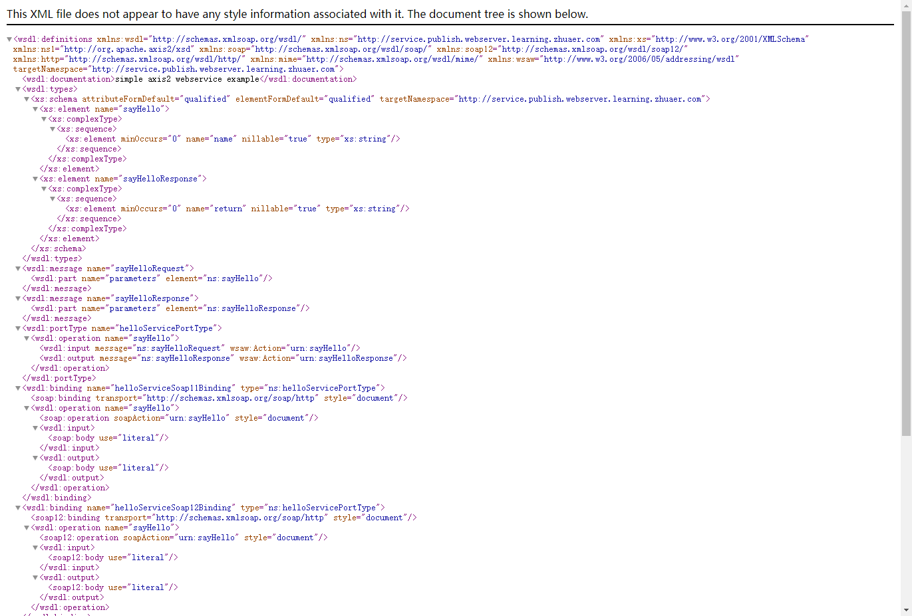

# webserver-service-xml

springboot 整合axis2 webserver

# 依赖包引用

```xml
<!--axis2 begin-->
<dependency>
	<groupId>org.apache.axis2</groupId>
	<artifactId>axis2-adb</artifactId>
	<version>1.8.0</version>
</dependency>
<dependency>
	<groupId>org.apache.axis2</groupId>
	<artifactId>axis2-kernel</artifactId>
	<version>1.8.0</version>
</dependency>
<dependency>
	<groupId>org.apache.axis2</groupId>
	<artifactId>axis2-transport-http</artifactId>
	<version>1.8.0</version>
</dependency>
<dependency>
	<groupId>org.apache.axis2</groupId>
	<artifactId>axis2-transport-local</artifactId>
	<version>1.8.0</version>
</dependency>
<dependency>
	<groupId>org.apache.axis2</groupId>
	<artifactId>axis2-jaxws</artifactId>
	<version>1.8.0</version>
</dependency>
<!--axis2 end-->
```

# services.xml配置文件创建

首先创建基本路径：WEB-INF/services/axis2/META-INF/services.xml

services.xml内容

```xml
<?xml version="1.0" encoding="UTF-8" ?>
<serviceGroup>
    <service name="helloService" scope="application" targetNamespace="http://service.publish.webserver.learning.zhuaer.com" >
        <description>simple axis2 webservice example</description>
        <schema schemaNamespace="http://service.publish.webserver.learning.zhuaer.com" />
        <parameter name="ServiceClass">com.zhuaer.learning.webserver.publish.service.HelloService</parameter>
        <operation name="sayHello">
            <messageReceiver class = "org.apache.axis2.rpc.receivers.RPCMessageReceiver" />
        </operation>
    </service>
</serviceGroup>
```

# 创建上路包路径和配置类

Axis2WsClient主要用于测试webservice调用结果(可以不用，用soapUI来测试也可以),内容如下：

```java
import org.apache.axis2.AxisFault;
import org.apache.axis2.addressing.EndpointReference;
import org.apache.axis2.client.Options;
import org.apache.axis2.rpc.client.RPCServiceClient;

import javax.xml.namespace.QName;

/**
 * @ClassName Axis2WsClient
 * @Description TODO
 * @Author zhua
 * @Date 2021/9/24 9:15
 * @Version 1.0
 */
public class Axis2WsClient {

    public static void callWs() throws AxisFault {
        try {
            EndpointReference targetEPR = new EndpointReference("http://127.0.0.1:8080/services/helloService?wsdl");

            RPCServiceClient sender = new RPCServiceClient();
            Options options = sender.getOptions();
            options.setTimeOutInMilliSeconds(2 * 20000L); //超时时间20s
            options.setTo(targetEPR);
            QName qName = new QName("http://service.publish.webserver.learning.zhuaer.com", "sayHello");
            String name = "i am zhua";
            Object[] param = new Object[]{name};
//            Object[] param = new Object[]{};
            //这是针对返值类型的
            Class<?>[] types = new Class[]{String.class};
            Object[] response = sender.invokeBlocking(qName, param, types);
            System.out.println(response[0]);
        } catch (AxisFault e) {
            e.printStackTrace();
        }
    }

    public static void main(String[] args) {
        try {
            callWs();
        } catch (AxisFault axisFault) {
            axisFault.printStackTrace();
        }
    }

}
```

Axis2WebServiceConfiguration是webservice最主要的配置类，主要作用为读取services.xml配置文件，内容如下：

```java
import com.zhuaer.learning.webserver.publish.util.FileCopyUtils;
import org.apache.axis2.transport.http.AxisServlet;
import org.springframework.boot.web.servlet.ServletRegistrationBean;
import org.springframework.context.annotation.Bean;
import org.springframework.context.annotation.Configuration;

import java.io.IOException;

/**
 * @ClassName Axis2WebServiceConfiguration
 * @Description TODO
 * @Author zhua
 * @Date 2021/9/24 9:02
 * @Version 1.0
 */
@Configuration
public class Axis2WebServiceConfiguration {

    @Bean
    public ServletRegistrationBean axis2Servlet() {
        ServletRegistrationBean servletRegistrationBean = new ServletRegistrationBean();
        servletRegistrationBean.setServlet(new AxisServlet());
        servletRegistrationBean.addUrlMappings("/services/*");
        // 通过默认路径无法找到services.xml，这里需要指定一下路径，且必须是绝对路径
        String path = this.getClass().getResource("/WEB-INF").getPath().toString();
        if (path.toLowerCase().startsWith("file:")) {
            path = path.substring(5);
        }
        if (path.indexOf("!") != -1) {
            try {
                FileCopyUtils.copy("WEB-INF/services/axis2/META-INF/services.xml");
            } catch (IOException e) {
                e.printStackTrace();
            }
            path = path.substring(0, path.lastIndexOf("/", path.indexOf("!"))) + "/WEB-INF";
        }
        //System.out.println("xml配置文件,path={ "+path+" }");
        servletRegistrationBean.addInitParameter("axis2.repository.path", path);
        servletRegistrationBean.setLoadOnStartup(1);
        return servletRegistrationBean;
    }
}
```

HelloService为业务测试类，你的主要业务体现，内容如下：

```java
/**
 * @ClassName HelloService
 * @Description TODO
 * @Author zhua
 * @Date 2021/9/24 9:02
 * @Version 1.0
 */
public class HelloService {

    public String sayHello(String name) {
        return "hello， " +  name;
    }
}

```

FileCopyUtils上面Axis2WebServiceConfiguration配置类有用到，主要作用确保service.xml的调用，代码如下：

```java
import org.apache.commons.io.IOUtils;
import org.slf4j.Logger;
import org.slf4j.LoggerFactory;
import org.springframework.core.io.support.PathMatchingResourcePatternResolver;

import java.io.ByteArrayInputStream;
import java.io.File;
import java.io.IOException;
import java.io.InputStream;
import java.net.URL;
import java.nio.file.Files;
import java.nio.file.Path;
import java.nio.file.Paths;

/**
 * @ClassName FileCopyUtils
 * @Description 将jar内的文件复制到jar包外的同级目录下
 * @Author zhua
 * @Date 2021/9/24 8:59
 * @Version 1.0
 */
public class FileCopyUtils {

    private static final Logger log = LoggerFactory.getLogger(FileCopyUtils.class);

    private static InputStream getResource(String location) throws IOException {
        InputStream in=null;
        try {
            PathMatchingResourcePatternResolver resolver = new PathMatchingResourcePatternResolver();
            in = resolver.getResource(location).getInputStream();
            byte[] byteArray = IOUtils.toByteArray(in);
            return new ByteArrayInputStream(byteArray);
        }catch (Exception e){
            e.printStackTrace();
            log.error("getResource is error: {}", e);
            return null;
        }finally {
            if (in != null) {
                in.close();
            }
        }
    }

    /**
     * 获取项目所在文件夹的绝对路径
     * @return
     */
    private static String getCurrentDirPath() {
        URL url = FileCopyUtils.class.getProtectionDomain().getCodeSource().getLocation();
        String path = url.getPath();
        if(path.startsWith("file:")) {
            path = path.replace("file:", "");
        }
        if(path.contains(".jar!/")) {
            path = path.substring(0, path.indexOf(".jar!/")+4);
        }

        File file = new File(path);
        path = file.getParentFile().getAbsolutePath();
        return path;
    }

    private static Path getDistFile(String path) throws IOException {
        String currentRealPath = getCurrentDirPath();
        Path dist = Paths.get(currentRealPath + File.separator + path);
        Path parent = dist.getParent();
        if(parent != null) {
            Files.createDirectories(parent);
        }
        Files.deleteIfExists(dist);
        return dist;
    }

    /**
     * 复制classpath下的文件到jar包的同级目录下
     * @param location 相对路径文件,例如kafka/kafka_client_jaas.conf
     * @return
     * @throws IOException
     */
    public static String copy(String location) throws IOException {
        InputStream in = getResource("classpath:"+location);
        Path dist = getDistFile(location);
        Files.copy(in, dist);
        in.close();
        return dist.toAbsolutePath().toString();
    }

}

```

# 启动项目

```java
2021-09-24 09:54:41.719  INFO 8360 --- [  restartedMain] o.s.b.d.a.OptionalLiveReloadServer       : LiveReload server is running on port 35729
2021-09-24 09:54:41.775  INFO 8360 --- [  restartedMain] o.a.a.d.WarBasedAxisConfigurator         : Could not find axis2.xml, loading default org/apache/axis2/deployment/axis2_default.xml from classpath
2021-09-24 09:54:42.184  INFO 8360 --- [  restartedMain] o.a.axis2.deployment.DeploymentEngine    : No modules directory was found under D:\Java\Workspaces\Idea\zhuaer-learning\learning-webserver\webserver-service-xml\target\classes\WEB-INF.
2021-09-24 09:54:42.258  INFO 8360 --- [  restartedMain] o.a.axis2.deployment.DeploymentEngine    : Deploying Web service: axis2 - file:/D:/Java/Workspaces/Idea/zhuaer-learning/learning-webserver/webserver-service-xml/target/classes/WEB-INF/services/axis2/
2021-09-24 09:54:42.266  WARN 8360 --- [  restartedMain] o.a.axis2.transport.http.AxisServlet     : No transportReceiver for org.apache.axis2.transport.http.AxisServletListener found. An instance for HTTP will be configured automatically. Please update your axis2.xml file!
2021-09-24 09:54:42.272  INFO 8360 --- [  restartedMain] o.s.b.w.embedded.tomcat.TomcatWebServer  : Tomcat started on port(s): 8080 (http) with context path ''
2021-09-24 09:54:42.286  INFO 8360 --- [  restartedMain] c.z.l.w.publish.WebServerApplication     : Started WebServerApplication in 3.393 seconds (JVM running for 6.247)
```

出现以上日志说明成功。

# 测试

先用网址访问：http://127.0.0.1:8080/services/helloService?wsdl

页面返回xml数据说明成功

