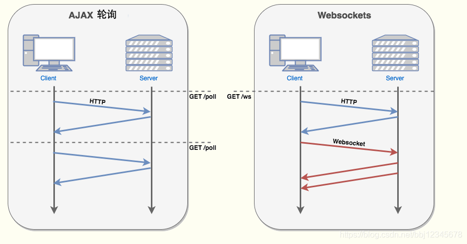

# websocket-springboot

SpringBoot整合WebSocket实现前后端互推消息

## 1、什么是WebSocket

WebSocket 是 HTML5 开始提供的一种在单个 TCP 连接上进行全双工通讯的协议。WebSocket 使得客户端和服务器之间的数据交换变得更加简单，允许服务端主动向客户端推送数据。在 WebSocket API 中，浏览器和服务器只需要完成一次握手，两者之间就直接可以创建持久性的连接，并进行双向数据传输。

在 WebSocket API 中，浏览器和服务器只需要做一个握手的动作，然后，浏览器和服务器之间就形成了一条快速通道。两者之间就直接可以数据互相传送。HTML5 定义的 WebSocket 协议，能更好的节省服务器资源和带宽，并且能够更实时地进行通讯。

## 2、实现原理

可以看到，浏览器通过 JavaScript 向服务器发出建立 WebSocket 连接的请求，连接建立以后，客户端和服务器端就可以通过 TCP 连接直接交换数据。第一次握手是基于HTTP协议实现的，当获取 Web Socket 连接后，就可以通过 `send()` 方法来向服务器发送数据，并通过 `onmessage` 事件来接收服务器返回的数据。

## 3、为什么需要 WebSocket

答案很简单，因为 HTTP 协议有一个缺陷：通信只能由客户端发起，HTTP 协议做不到服务器主动向客户端推送信息

## 添加依赖

    <dependency>
    	<groupId>org.springframework.boot</groupId>
    	<artifactId>spring-boot-starter-websocket</artifactId>
    </dependency>
    <dependency>
    	<groupId>org.springframework.boot</groupId>
    	<artifactId>spring-boot-starter-web</artifactId>
    </dependency>
    <dependency>
    	<groupId>org.springframework.boot</groupId>
    	<artifactId>spring-boot-starter-thymeleaf</artifactId>
    </dependency>
    
## application.xml配置

    server:
      port: 8081
      servlet:
        context-path: /scoket
    
    spring:
      application:
        name: @artifactId@
      freemarker:
        request-context-attribute: request
    #    prefix: /templates/
        suffix: .html
        content-type: text/html
        enabled: true
        cache: false
        charset: UTF-8
        allow-request-override: false
        expose-request-attributes: true
        expose-session-attributes: true
        expose-spring-macro-helpers: true
    #    template-loader-path: classpath:/templates/

## 配置类

启用WebSocket的支持

    import org.springframework.context.annotation.Bean;
    import org.springframework.context.annotation.Configuration;
    import org.springframework.web.socket.server.standard.ServerEndpointExporter;
    
    /**
     * @ClassName WebsocketConfig
     * @Description 开启WebSocket支持
     * @Author zhua
     * @Date 2020/10/27 16:01
     * @Version 1.0
     */
    @Configuration
    public class WebsocketConfig {
    
        /**
         * ServerEndpointExporter 作用
         * 这个Bean会自动注册使用@ServerEndpoint注解声明的websocket endpoint
         * @return
         */
        @Bean
        public ServerEndpointExporter serverEndpointExporter() {
            return new ServerEndpointExporter();
        }
    
    }

## WebSocketServer

这就是重点了，核心都在这里。

1、因为WebSocket是类似客户端服务端的形式(采用ws协议)，那么这里的WebSocketServer其实就相当于一个ws协议的Controller

2、直接`@ServerEndpoint("/imserver/{userId}")` 、`@Component`启用即可，然后在里面实现`@OnOpen`开启连接，`@onClose`关闭连接，`@onMessage`接收消息等方法。

3、新建一个ConcurrentHashMap webSocketMap 用于接收当前userId的WebSocket，方便IM之间对userId进行推送消息。*单机版*实现到这里就可以。

    import com.alibaba.fastjson.JSON;
    import com.alibaba.fastjson.JSONObject;
    import org.apache.commons.lang3.StringUtils;
    import org.slf4j.Logger;
    import org.slf4j.LoggerFactory;
    import org.springframework.stereotype.Component;
    
    import javax.websocket.*;
    import javax.websocket.server.PathParam;
    import javax.websocket.server.ServerEndpoint;
    import java.io.IOException;
    import java.util.concurrent.ConcurrentHashMap;
    
    /**
     * @ClassName WebSocketServer
     * @Description TODO
     * @Author zhua
     * @Date 2020/10/27 16:03
     * @Version 1.0
     */
    
    @ServerEndpoint("/imserver/{userId}")
    @Component
    public class WebSocketServer {
    
        private final static Logger log = LoggerFactory.getLogger(WebSocketServer.class);
        /**静态变量，用来记录当前在线连接数。应该把它设计成线程安全的。*/
        private static int onlineCount = 0;
        /**concurrent包的线程安全Set，用来存放每个客户端对应的MyWebSocket对象。*/
        private static ConcurrentHashMap<String,WebSocketServer> webSocketMap = new ConcurrentHashMap<>();
        /**与某个客户端的连接会话，需要通过它来给客户端发送数据*/
        private Session session;
        /**接收userId*/
        private String userId="";
    
        /**
         * 连接建立成功调用的方法*/
        @OnOpen
        public void onOpen(Session session, @PathParam("userId") String userId) {
            this.session = session;
            this.userId=userId;
            if(webSocketMap.containsKey(userId)){
                webSocketMap.remove(userId);
                webSocketMap.put(userId,this);
                //加入set中
            }else{
                webSocketMap.put(userId,this);
                //加入set中
                addOnlineCount();
                //在线数加1
            }
    
            log.info("用户连接:"+userId+",当前在线人数为:" + getOnlineCount());
    
            try {
                sendMessage("连接成功");
            } catch (IOException e) {
                log.error("用户:"+userId+",网络异常!!!!!!");
            }
        }
    
        /**
         * 连接关闭调用的方法
         */
        @OnClose
        public void onClose() {
            if(webSocketMap.containsKey(userId)){
                webSocketMap.remove(userId);
                //从set中删除
                subOnlineCount();
            }
            log.info("用户退出:"+userId+",当前在线人数为:" + getOnlineCount());
        }
    
        /**
         * 收到客户端消息后调用的方法
         *
         * @param message 客户端发送过来的消息*/
        @OnMessage
        public void onMessage(String message, Session session) {
            log.info("用户消息:"+userId+",报文:"+message);
            //可以群发消息
            //消息保存到数据库、redis
            if(StringUtils.isNotBlank(message)){
                try {
                    //解析发送的报文
                    JSONObject jsonObject = JSON.parseObject(message);
                    //追加发送人(防止串改)
                    jsonObject.put("fromUserId",this.userId);
                    String toUserId=jsonObject.getString("toUserId");
                    //传送给对应toUserId用户的websocket
                    if(StringUtils.isNotBlank(toUserId)&&webSocketMap.containsKey(toUserId)){
                        webSocketMap.get(toUserId).sendMessage(jsonObject.toJSONString());
                    }else{
                        log.error("请求的userId:"+toUserId+"不在该服务器上");
                        //否则不在这个服务器上，发送到mysql或者redis
                    }
                }catch (Exception e){
                    e.printStackTrace();
                }
            }
        }
    
        /**
         *
         * @param session
         * @param error
         */
        @OnError
        public void onError(Session session, Throwable error) {
            log.error("用户错误:"+this.userId+",原因:"+error.getMessage());
            error.printStackTrace();
        }
        /**
         * 实现服务器主动推送
         */
        public void sendMessage(String message) throws IOException {
            this.session.getBasicRemote().sendText(message);
        }
    
    
        /**
         * 发送自定义消息
         * */
        public static void sendInfo(String message,@PathParam("userId") String userId) throws IOException {
            log.info("发送消息到:"+userId+"，报文:"+message);
            if(StringUtils.isNotBlank(userId)&&webSocketMap.containsKey(userId)){
                webSocketMap.get(userId).sendMessage(message);
            }else{
                log.error("用户"+userId+",不在线！");
            }
        }
    
        public static synchronized int getOnlineCount() {
            return onlineCount;
        }
    
        public static synchronized void addOnlineCount() {
            WebSocketServer.onlineCount++;
        }
    
        public static synchronized void subOnlineCount() {
            WebSocketServer.onlineCount--;
        }
    
    }
    
## 消息推送

至于推送新信息，可以再自己的Controller写个方法调用WebSocketServer.sendInfo();即可

    @RestController
    public class WebSocketController {
    
        @GetMapping("page")
        public ModelAndView page(){
            return new ModelAndView("websocket");
        }
    
        @RequestMapping("/push/{toUserId}")
        public ResponseEntity<String> pushToWeb(String message, @PathVariable String toUserId) throws IOException {
            WebSocketServer.sendInfo(message,toUserId);
            return ResponseEntity.ok("MSG SEND SUCCESS");
        }
    
    }

## 页面发起

页面用js代码调用`websocket`，当然，太古老的浏览器是不行的，一般新的浏览器或者谷歌浏览器是没问题的。还有一点，记得协议是`ws`的，如果使用了一些路径类，可以replace(“http”,“ws”)来替换协议。

    <!DOCTYPE html>
    <html>
    <head>
        <meta charset="utf-8">
        <title>websocket通讯</title>
    </head>
    
    
    <body>
    
【userId】：
<input id="userId" name="userId" type="text" value="10">

    
【toUserId】：
<input id="toUserId" name="toUserId" type="text" value="20">

    
【toUserId】：
<input id="contentText" name="contentText" type="text" value="hello websocket">

    
【操作】：
<button onclick="openSocket()">开启socket</button>

    
【操作】：
<button onclick="sendMessage()">发送消息</button>

    </body>
    
    </html>

完成以上工作，就可以启动项目测试了。打开两个页面，按F12调出控控制台查看测试效果：分别开启socket，再发送消息
