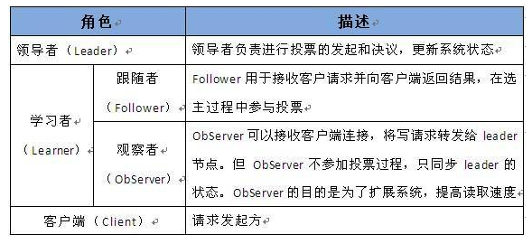

# learning-zookeeper

ZooKeeper 是一个典型的分布式数据一致性解决方案，分布式应用程序可以基于 ZooKeeper 实现诸如数据发布/订阅、负载均衡、命名服务、分布式协调/通知、集群管理、Master 选举、分布式锁和分布式队列等功能。

- [zookeeper 客户端](./zookeeper-client "zookeeper-client")
- [zookeeper 服务端](./zookeeper-server "zookeeper-server")

> **Zookeeper 版本号：3.6.0**

    <dependency>
        <groupId>org.apache.zookeeper</groupId>
        <artifactId>zookeeper</artifactId>
        <version>3.6.0</version>
    </dependency>

**主类：org.apache.zookeeper.ZooKeeper**

这是ZooKeeper客户端库的主要类。要使用ZooKeeper服务，应用程序必须首先实例化ZooKeeper类的对象。所有操作zookeeper的操作都将通过调用ZooKeeper类的方法来完成。除非另有说明，否则此类的方法是线程安全的。

客户端与服务器建立连接后，会为客户端分配一个会话ID。客户端将定期向服务器发送心跳以保持会话有效。只要客户端的会话ID保持有效，应用程序就可以通过客户端调用ZooKeeper API。

如果由于某种原因，客户端长时间无法向服务器发送心跳（例如，超过sessionTimeout值），则服务器将使会话到期，并且会话ID将失效。客户端对象将不再可用。要进行ZooKeeper API调用，应用程序必须创建一个新的客户端对象。

如果客户端当前连接的ZooKeeper服务器出现故障或者没有响应，则客户端将在其sessionID到期之前自动尝试连接到另一台zookeeper服务器。如果成功，应用程序可以继续使用客户端。

ZooKeeper API方法有同步或异步两种。同步方法会阻塞，直到服务器响应。异步方法只是将发送请求排队并立即返回。它们采用一个回调对象，该回调对象将在成功执行请求时执行，或者在错误时执行，并返回指示错误的返回代码。

一些成功的ZooKeeper API调用可以将监视(Watcher)留在ZooKeeper服务器中的“数据节点”上。其他成功的ZooKeeper API调用可以触发这些Watcher。一旦Watcher被触发，事件将被传递给客户，假如Watcher触发之后,立刻get节点信息,客户端在得到 Watch 消息之前肯定不可能看到更新后的数据。换句话说，更新通知先于更新结果。Watch 只会被触发一次。如果客户端想得到后续更新的通知，必须要在 Watch 被触发后重新注册一个 Watch。

当客户端丢失当前连接后重新连接服务器，所有被认为是触发的监视器，但是没有送达的事件将丢失。为了模式这个场景，客户端将产生一个特殊的事件，去告诉事件处理器连接被删除。这个特殊的事件的类型是EventNone 状态是KeeperStateDiscounnected。

**ZooKeeper类有如下几个构造器：**

    ZooKeeper(String connectString, int sessionTimeout, Watcher watcher);
    ZooKeeper(String connectString, int sessionTimeout, Watcher watcher, boolean canBeReadOnly);
    ZooKeeper(String connectString, int sessionTimeout, Watcher watcher, boolean canBeReadOnly, HostProvider aHostProvider);
    ZooKeeper(String connectString, int sessionTimeout, Watcher watcher, boolean canBeReadOnly, HostProvider aHostProvider, ZKClientConfig clientConfig);
    ZooKeeper(String connectString, int sessionTimeout, Watcher watcher, boolean canBeReadOnly, ZKClientConfig clientConfig);
    ZooKeeper(String connectString, int sessionTimeout, Watcher watcher, long sessionId, byte[] sessionPasswd);
    ZooKeeper(String connectString, int sessionTimeout, Watcher watcher, long sessionId, byte[] sessionPasswd, boolean canBeReadOnly);
    ZooKeeper(String connectString, int sessionTimeout, Watcher watcher, long sessionId, byte[] sessionPasswd, boolean canBeReadOnly, HostProvider aHostProvider);
    ZooKeeper(String connectString, int sessionTimeout, Watcher watcher, ZKClientConfig clientConfig);

**注意**：每个构造器创建连接都是异步的，构造方法启动与服务器的连接,然后立马返回,此时会话处于`CONNECTING`状态，通过watcher通知。此通知可以在构造方法调用返回之前或之后的任何时候到来。会话创建成功之后,状态会改为`CONNECTED`。

构造器将抛出两个异常：

`java.io.IOException` - 在网络故障的情况下

`java.lang.IllegalArgumentException` - ZooKeeper无效服务列表，或者 指定了无效的chroot路径(下面介绍connectString参数时会介绍chroot) 

**参数介绍：**

| 参数名                  | 描述                                                                                                                                                                                                                                                                                                                                                                                                                                                                                                                                                                                                                                                                          |
| -------------------------- | ------------------------------------------------------------------------------------------------------------------------------------------------------------------------------------------------------------------------------------------------------------------------------------------------------------------------------------------------------------------------------------------------------------------------------------------------------------------------------------------------------------------------------------------------------------------------------------------------------------------------------------------------------------------------- |
| connectString              | 要创建ZooKeeper客户端对象，应用程序需要传递一个连接字符串，其中包含逗号分隔的host:port列表，每个对应一个ZooKeeper服务器。例如：127.0.0.1:2181,127.0.0.1:2182,127.0.0.1:2183实例化的ZooKeeper客户端对象将从connectString中选择一个任意服务器并尝试连接到它。如果建立连接失败，将尝试连接字符串中的另一个服务器（顺序是非确定性的，因为是随机），直到建立连接。客户端将继续尝试，直到会话显式关闭。在3.2.0版本之后,也可以在connectString后面添加后缀字符串，如：127.0.0.1:2181,127.0.0.1:2182,127.0.0.1:2183/app/a,客户端连接上ZooKeeper服务器之后，所有对ZooKeeper的操作，都会基于这个根目录。例如，客户端对/foo/bar的操作，都会指向节点/app/a/foo/bar——这个目录也叫Chroot，即客户端隔离命名空间。 |
| sessionTimeout             | 会话超时（以毫秒为单位）客户端和服务端连接创建成功之后,ZooKeeper中会建立一个会话，在一个会话周期内，ZooKeeper客户端和服务端之间会通过心跳检测机制来维持会话的有效性，一旦在sessionTimeout时间内没有进行有效的心跳检测，会话就会失效。                                                                                                                                                                                                                                                                                                                                                           |
| watcher                    | 创建ZooKeeper客户端对象时,ZooKeeper允许客户端在构造方法中传入一个接口Watcher（org.apache.zookeeper.Watcher）的实现类对象来作为默认的Watcher事件通知处理器。当然，该参数可以设置为null以表明不需要设置默认的Watcher处理器。如果设置为null，日志中会有空指针异常，但是并不影响使用。                                                                                                                                                                                                                                                                                                             |
| canBeReadOnly              | 3.4之后添加的boolean类型的参数，用于标识当前会话是否支持“read-only”模式。默认情况下，在ZooKeeper集群中，一个机器如果和集群中过半以上机器失去了网络连接，那么这个机器将不再处理客户端请求（包括读写请求）。但是在某些使用场景下，当ZooKeeper服务器发生此类故障的时候，我们还是希望ZooKeeper服务器能够提供读服务（当然写服务肯定无法提供）——这就是ZooKeeper的“read-only”模式。                                                                                                                                                       |
| sessionId 和 sessionPasswd | 会话id和 会话密码，这两个参数能够唯一确定一个会话，同时客户端使用这两个参数实现客户端会话复用，从而达到恢复会话的效果，使用方法：第一次连接上ZooKeeper服务器后，客户端使用getSessionId()和getSessionPasswd()获取这两个值，如果需要会话复用,在重新创建ZooKeeper客户端对象的时候可以传过去，如果不需要会话复用，请使用不需要这些参数的其他构造函数。                                                                                                                                                                                                  |
| HostProvider               | 客户端地址列表管理器                                                                                                                                                                                                                                                                                                                                                                                                                                                                                                                                                                                                                                                        |

## zookeeper注册中心安装

centerOS下 载zookeeper

    wget http://mirrors.hust.edu.cn/apache/zookeeper/stable/apache-zookeeper-3.5.8.tar.gz
    tar zxvf apache-zookeeper-3.5.8.tar.gz
    cd apache-zookeeper-3.5.8/conf
    cp zoo_sample.cfg ./zoo.cfg

### 修改conf/zoo.cfg

zookeeper 下面有个bin、conf等目录，创建个 mkdir data目录

vi conf/zoo.cfg

    # The number of milliseconds of each tick
    tickTime=2000
    # The number of ticks that the initial
    # synchronization phase can take
    initLimit=10
    # The number of ticks that can pass between
    # sending a request and getting an acknowledgement
    syncLimit=5
    # the directory where the snapshot is stored.
    # do not use /tmp for storage, /tmp here is just
    # example sakes.
    dataDir=/tmp/zookeeper
    # the port at which the clients will connect
    clientPort=2181
    # the maximum number of client connections.
    # increase this if you need to handle more clients
    #maxClientCnxns=60
    #
    # Be sure to read the maintenance section of the
    # administrator guide before turning on autopurge.
    #
    # http://zookeeper.apache.org/doc/current/zookeeperAdmin.html#sc_maintenance
    #
    # The number of snapshots to retain in dataDir
    #autopurge.snapRetainCount=3
    # Purge task interval in hours
    # Set to "0" to disable auto purge feature
    #autopurge.purgeInterval=1
    ~                                

修改上面的dataDir=创建的data目录的地址

    dataDir=/developer/apache-zookeeper-3.5.8/data
    
### 启动

    ./bin/zkServer.sh start
    ./bin/zkServer.sh status
    ./bin/zkServer.sh stop
    
## zookeeper集群

在/usr/local下解压多份apache-zookeeper-3.5.8.tar.gz

分别命名为zookeeper1、zookeeper2、zookeeper3

在每个zookeeper目录里 mkdir data

然后在data目录下 touch myid

vi myid

第一个输入1，第二个输入2，第三个输入3

cp zoo_sample.cfg ./zoo.cfg

zookeeper1里的zoo.cfg修改

    dataDir=/usr/local/zookeeper/zookeeper1/data
    clientPort=2181
    server.1=127.0.0.1:2881:3881
    server.2=127.0.0.1:2882:3882
    server.3=127.0.0.1:2883:3883
    
zookeeper2里的zoo.cfg修改

    dataDir=/usr/local/zookeeper/zookeeper2/data
    clientPort=2182
    server.1=127.0.0.1:2881:3881
    server.2=127.0.0.1:2882:3882
    server.3=127.0.0.1:2883:3883

zookeeper3里的zoo.cfg修改

    dataDir=/usr/local/zookeeper/zookeeper3/data
    clientPort=2183
    server.1=127.0.0.1:2881:3881
    server.2=127.0.0.1:2882:3882
    server.3=127.0.0.1:2883:3883

vim start-zookeeper.sh

输入

    cd zookeeper1/bin
    ./zkServer.sh start
    cd ../../
    cd zookeeper2/bin
    ./zkServer.sh start
    cd ../../
    cd zookeeper3/bin
    ./zkServer.sh start
    cd ../../

esc :wq保存

chmod u+x start-zookeeper.sh

./start-zookeeper.sh 启动

## 关于 ZooKeeper 的一些重要概念

### 重要概念

- ZooKeeper 本身就是一个分布式程序（只要半数以上节点存活，ZooKeeper 就能正常服务）。
- 为了保证高可用，最好是以集群形态来部署 ZooKeeper，这样只要集群中大部分机器是可用的（能够容忍一定的机器故障），那么 ZooKeeper 本身仍然是可用的。
- ZooKeeper 将数据保存在内存中，这也就保证了 高吞吐量和低延迟（但是内存限制了能够存储的容量不太大，此限制也是保持znode中存储的数据量较小的进一步原因）。
- ZooKeeper 是高性能的。 在“读”多于“写”的应用程序中尤其地高性能，因为“写”会导致所有的服务器间同步状态。（“读”多于“写”是协调服务的典型场景。）
- ZooKeeper有临时节点的概念。 当创建临时节点的客户端会话一直保持活动，瞬时节点就一直存在。而当会话终结时，瞬时节点被删除。持久节点是指一旦这个ZNode被创建了，除非主动进行ZNode的移除操作，否则这个ZNode将一直保存在Zookeeper上。
- ZooKeeper 底层其实只提供了两个功能：①管理（存储、读取）用户程序提交的数据；②为用户程序提交数据节点监听服务。

### 会话（Session）

Session 指的是 ZooKeeper 服务器与客户端会话。在 ZooKeeper 中，一个客户端连接是指客户端和服务器之间的一个 TCP 长连接。客户端启动的时候，首先会与服务器建立一个 TCP 连接，从第一次连接建立开始，客户端会话的生命周期也开始了。通过这个连接，客户端能够通过心跳检测与服务器保持有效的会话，也能够向Zookeeper服务器发送请求并接受响应，同时还能够通过该连接接收来自服务器的Watch事件通知。 Session的sessionTimeout值用来设置一个客户端会话的超时时间。当由于服务器压力太大、网络故障或是客户端主动断开连接等各种原因导致客户端连接断开时，只要在sessionTimeout规定的时间内能够重新连接上集群中任意一台服务器，那么之前创建的会话仍然有效。

在为客户端创建会话之前，服务端首先会为每个客户端都分配一个sessionID。由于 sessionID 是 Zookeeper 会话的一个重要标识，许多与会话相关的运行机制都是基于这个 sessionID 的，因此，无论是哪台服务器为客户端分配的 sessionID，都务必保证全局唯一。

### Znode

在谈到分布式的时候，我们通常说的“节点"是指组成集群的每一台机器。然而，在Zookeeper中，“节点"分为两类，第一类同样是指构成集群的机器，我们称之为机器节点；第二类则是指数据模型中的数据单元，我们称之为数据节点一一ZNode。

Zookeeper将所有数据存储在内存中，数据模型是一棵树（Znode Tree)，由斜杠（/）的进行分割的路径，就是一个Znode，例如/foo/path1。每个上都会保存自己的数据内容，同时还会保存一系列属性信息。

在Zookeeper中，node可以分为持久节点和临时节点两类。所谓持久节点是指一旦这个ZNode被创建了，除非主动进行ZNode的移除操作，否则这个ZNode将一直保存在Zookeeper上。而临时节点就不一样了，它的生命周期和客户端会话绑定，一旦客户端会话失效，那么这个客户端创建的所有临时节点都会被移除。另外，ZooKeeper还允许用户为每个节点添加一个特殊的属性：SEQUENTIAL.一旦节点被标记上这个属性，那么在这个节点被创建的时候，Zookeeper会自动在其节点名后面追加上一个整型数字，这个整型数字是一个由父节点维护的自增数字。

### 版本

在前面我们已经提到，Zookeeper 的每个 ZNode 上都会存储数据，对应于每个ZNode，Zookeeper 都会为其维护一个叫作 Stat 的数据结构，Stat中记录了这个 ZNode 的三个数据版本，分别是version（当前ZNode的版本）、cversion（当前ZNode子节点的版本）和 cversion（当前ZNode的ACL版本）。

### Watcher

Watcher（事件监听器），是Zookeeper中的一个很重要的特性。Zookeeper允许用户在指定节点上注册一些Watcher，并且在一些特定事件触发的时候，ZooKeeper服务端会将事件通知到感兴趣的客户端上去，该机制是Zookeeper实现分布式协调服务的重要特性。

### ACL

Zookeeper采用ACL（AccessControlLists）策略来进行权限控制，类似于 UNIX 文件系统的权限控制。Zookeeper 定义了如下5种权限。

    CREATE:创建子节点权限。
    READ:获取节点数据和子节点列表的权限。
    WRITE:更新节点数据的权限。
    DELETE:删除子节点的权限。
    ADMIN:设置节点ACL的权限。
    
    其中尤其需要注意的是，CREATE和DELETE这两种权限都是针对子节点的权限控制。

## ZooKeeper 特点

- 顺序一致性： 从同一客户端发起的事务请求，最终将会严格地按照顺序被应用到 ZooKeeper 中去，对于来自客户端的每个更新请求，ZooKeeper 都会分配一个全局唯一的递增编号，这个编号反应了所有事务操作的先后顺序，应用程序可以使用 ZooKeeper 这个特性来实现更高层次的同步原语。 这个编号也叫做时间戳——zxid（Zookeeper Transaction Id）。
- 原子性： 所有事务请求的处理结果在整个集群中所有机器上的应用情况是一致的，也就是说，要么整个集群中所有的机器都成功应用了某一个事务，要么都没有应用。
- 单一系统映像 ： 无论客户端连到哪一个 ZooKeeper 服务器上，其看到的服务端数据模型都是一致的。
- 可靠性： 一旦一次更改请求被应用，更改的结果就会被持久化，直到被下一次更改覆盖。

在 ZooKeeper 中引入了Leader、Follower 和 Observer 三种角色。如下图所示

ZooKeeper 集群中的所有机器通过一个 Leader 选举过程来选定一台称为 “Leader” 的机器，Leader 既可以为客户端提供写服务又能提供读服务。除了 Leader 外，Follower 和 Observer 都只能提供读服务。Follower 和 Observer 唯一的区别在于 Observer 机器不参与 Leader 的选举过程，也不参与写操作的“过半写成功”策略，因此 Observer 机器可以在不影响写性能的情况下提升集群的读性能。

ZooKeeper 的写数据流程主要分为以下几步：

a)、比如 Client 向 ZooKeeper 的 Server1 上写数据，发送一个写请求。

b)、如果Server1不是Leader，那么Server1 会把接受到的请求进一步转发给Leader，因为每个ZooKeeper的Server里面有一个是Leader。这个Leader 会将写请求广播给各个Server，比如Server1和Server2， 各个Server写成功后就会通知Leader。

c)、当Leader收到大多数 Server 数据写成功了，那么就说明数据写成功了。如果这里三个节点的话，只要有两个节点数据写成功了，那么就认为数据写成功了。写成功之后，Leader会告诉Server1数据写成功了。

d)、Server1会进一步通知 Client 数据写成功了，这时就认为整个写操作成功。

## 如何使用zookeeper实现分布式锁？

假设锁空间的根节点为/lock，客户端连接zookeeper，并在/lock下创建临时的且有序的子节点，第一个客户端对应的子节点为/lock/lock-0000000000，第二个为/lock/lock-0000000001，以此类推。

客户端获取/lock下的子节点列表，判断自己创建的子节点是否为当前子节点列表中序号最小的子节点，如果是则认为获得锁，否则监听/lock的子节点变更消息，获得子节点变更通知后重复此步骤直至获得锁；执行业务代码；完成业务流程后，删除对应的子节点释放锁。

创建的临时节点能够保证在故障的情况下锁也能被释放，考虑这么个场景：假如客户端a当前创建的子节点为序号最小的节点，获得锁之后客户端所在机器宕机了，客户端没有主动删除子节点；如果创建的是永久的节点，那么这个锁永远不会释放，导致死锁；由于创建的是临时节点，客户端宕机后，过了一定时间zookeeper没有收到客户端的心跳包判断会话失效，将临时节点删除从而释放锁。

获取子节点列表与设置监听这两步操作的原子性问题，考虑这么个场景：客户端a对应子节点为/lock/lock-0000000000，客户端b对应子节点为/lock/lock-0000000001，客户端b获取子节点列表时发现自己不是序号最小的，但是在设置监听器前客户端a完成业务流程删除了子节点/lock/lock-0000000000，客户端b设置的监听器岂不是丢失了这个事件从而导致永远等待了？这个问题不存在的。因为zookeeper提供的API中设置监听器的操作与读操作是原子执行的，也就是说在读子节点列表时同时设置监听器，保证不会丢失事件。

最后，对于这个算法有个极大的优化点：假如当前有1000个节点在等待锁，如果获得锁的客户端释放锁时，这1000个客户端都会被唤醒，这种情况称为“羊群效应”；在这种羊群效应中，zookeeper需要通知1000个客户端，这会阻塞其他的操作，最好的情况应该只唤醒新的最小节点对应的客户端。应该怎么做呢？在设置事件监听时，每个客户端应该对刚好在它之前的子节点设置事件监听，例如子节点列表为/lock/lock-0000000000、/lock/lock-0000000001、/lock/lock-0000000002，序号为1的客户端监听序号为0的子节点删除消息，序号为2的监听序号为1的子节点删除消息。

所以调整后的分布式锁算法流程如下：

客户端连接zookeeper，并在/lock下创建临时的且有序的子节点，第一个客户端对应的子节点为/lock/lock-0000000000，第二个为/lock/lock-0000000001，以此类推；

客户端获取/lock下的子节点列表，判断自己创建的子节点是否为当前子节点列表中序号最小的子节点，如果是则认为获得锁，否则监听刚好在自己之前一位的子节点删除消息，获得子节点变更通知后重复此步骤直至获得锁；执行业务代码；完成业务流程后，删除对应的子节点释放锁。

虽然zookeeper原生客户端暴露的API已经非常简洁了，但是实现一个分布式锁还是比较麻烦的…我们可以直接使用curator这个开源项目提供的zookeeper分布式锁实现。

我们只需要引入下面这个包（基于maven）：

    <dependency>
        <groupId>org.apache.curator</groupId>
        <artifactId>curator-recipes</artifactId>
        <version>4.0.0</version>
    </dependency>

然后就可以用啦！代码如下：

public static void main(String[] args) throws Exception {

    public static void main(String[] args) throws Exception {
    
    	//创建zookeeper的客户端
    	RetryPolicy retryPolicy = new ExponentialBackoffRetry(1000, 3);
    
    	CuratorFramework client = CuratorFrameworkFactory.newClient("192.168.1.181:2181,192.168.1.182:2181,192.168.1.183:2181", retryPolicy);
    	client.start();
    	//创建分布式锁, 锁空间的根节点路径为/curator/lock
    	InterProcessMutex mutex = new InterProcessMutex(client, "/curator/lock");
    	mutex.acquire();
    	//获得了锁, 进行业务流程
    	System.out.println("Enter mutex");
    	//完成业务流程, 释放锁
    	mutex.release();
    	//关闭客户端
    	client.close();
    }   

